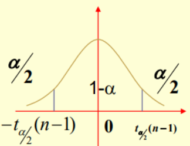

# 概率与数理统计

###### by 南京大学计算机科学与技术系 张城铨

## 第一章 随机事件及概率

### 1.1 随机试验与随机事件

- 各种现象分为两类：确定性现象（只有一种结果）、非确定性现象（有多种结果）
  - 非确定性现象又称**随机现象**，**随机试验**是对随机现象的一次观测。
  - 随机试验有以下特征：
    - 相同条件下试验可重复进行
    - 每次试验有多种结果，但试验之前知道所有可能的结果
    - 每次试验出现这些已知结果之一，但并不确定是哪一个
- 随机试验$E$中，所有可能结果的集合称为**样本空间**，记为$\Omega$，每一个可能结果称为**基本事件**或**样本点**，记为$e$
- 一些样本点的集合称为**随机事件**，简称**事件**，即事件是样本空间的一个子集
  - 两个特殊的事件：
    - 必然事件：样本空间$\Omega$
    - 不可能事件：空集$\Phi$

### 1.2 事件间关系及运算

- 事件间关系
  - 包含关系（$A$发生必导致$B$发生，则$A$包含于$B$，即$B$包含$A$）
  - **互不相容（互斥）**：$AB=\Phi$，$AB$不可能同时发生
  - 相等关系
- 运算
  - 事件的交、并
  - 事件的差：$A-B$：事件$A$发生而$B$不发生
  - 对立事件（互逆事件）：$A$不发生即$\overline{A}$ 
  - 运算律
    - 交换律
    - 结合律
    - 分配律
    - 对偶律
  - 一些等式
    - $A-B=A-AB=A\overline{B}$
    - $A=(A-B)\ \bigcup\ AB$
    - $A\ \bigcup\ B=A\ \bigcup\ (B-A)\ =\ (A-B)\ \bigcup\ AB\ \bigcup\ (B-A)$ 这里就可以看出$A\bigcup B$ 可以分成互斥的三个部分

### 1.3 概率和频率

- 概率的性质
  - $P(\Phi) = 0$
  - **有限可加性**：$A_1, A_2,..., A_n$两两不相容，则$P(A_1\bigcup A_2 \bigcup...\bigcup A_n)\ = \ P(A_1) + P(A_2) + ... + P(A_n)$
  - 单调不减性：若$A\subset B$ ，则$P(B)\geq P(A) $ 
  - **事件差：$P(A-B)=P(A)-P(AB)$**
  - 加法定理：$P(A\bigcup B)\ = \ P(A) + P(B) - P(AB)$
  - 互补性：$P(\overline{A}) = 1 - P(A)$

### 1.4 古典概型

- 有限性：样本空间有限
- 等可能性：每一个样本点发生的概率都相同
- 事件$A$的概率就等于它所含的样本点个数$\div$样本空间大小
- **抽签原理**：$a$只白球，$b$只红球，**依次不放回**从中取出一个球，第$k$次抽中红球(或白球)的**概率相等**，都是$\frac{b}{a+b}(\frac{a}{a+b})$ **(与$k$无关)**
  - 不管$k$取何值，第$k$次取到红球都有$b$种，样本空间大小是次数的全排列$(a+b)!$，除了第$k$次以外的$a+b-1$次取也是全排列$(a+b-1)!$所以概率为$\frac{b(a+b-1)!}{(a+b)!}=\frac{b}{a+b}$
- $N$件产品，其中有$M$件次品，取出$n$件，求其中恰好有$k$件次品的概率
  - **不放回**抽样：
    - 取法共有$C_N^n$种
    - 取到的有$k$个是次品，即有$n-k$个正品，那么取到次品共有$C_M^k$种取法，正品有$C_{N-M}^{n-k}$种
    - **所求概率为$\frac{C_M^kC_{N-M}^{n-k}}{C_N^n}$**
  - **有放回**抽样：
    - 取法共$N^n$种
    - 取到次品$k$个，每件次品有$M$种取法，共$M^k$种，同理，正品有$(N-M)^{n-k}$种
    - 取出的$n$个位置，其中有$k$件次品，即从$n$个位置中选$k$个放次品，$C_n^k$种选法
    - **所求概率为$\frac{C_{n}^{k}M^k(N-M)^{n-k}}{N^n}=C_n^k(\frac{M}{N})^k(1-\frac{M}{N})^{n-k}$**
- 课件的例子：三个球放入三个盒子，求只空一个盒子的概率：
  - $3$个球每个球都有$3$种放法，故共$3^3$种
  - 分三步：
    - 先选出两个盒子要放（即一个盒子空出来），$C_3^2$
    - 选出的两个盒子一个放俩球，另一个放一个球，那么选出那个放一个球的，$C_2^1$，剩下那个就是放俩球
    - 放一个球，就要从$3$个球中选出一个，$C_3^1$，剩下两个直接放到另一个盒子里
  - 故答案是$\frac{C_3^2C_2^1C_3^1}{3^3}=\frac23$
- 例（书$p8$例1.7）将$n$只小球随机放入$N$个盒子$(N\geqslant n)$，求：
  - 事件$A$：恰有$n$个盒子每盒$1$球
  - 事件$B$：某指定的$n$个盒子里各有$1$球
- **解答**: $n$个球放入$N$个盒子，每个球有$N$种选择，共有$N^n$种情况
  - 先选$n$个盒子, 有$C_N^n$种；$n$个球放入$n$个盒子的排列有$n!$种, 则$P(A)=\frac{C_N^n·n!}{N^n}$
    - 仔细看一下，**分子上**其实也就是把$n$个球放入$N$个盒子，每个盒子至多一个球，等价转换一下，**从$N$个东西中取出$n$个进行排列**，即$A_N^n$
  - 盒子特定好了，所以$P(B)=\frac{n!}{N^n}$
- **这个例子中的模型有很多应用**，再看一个生日问题：
  - 某班有$n$个同学，求至少两人生日相同的概率
    - 考虑对立事件：所有人生日都不同——相当于是$n$个球放入$365$个盒子，恰有$n$个盒子每盒$1$球：$P(\overline{A})=\frac{C_N^n·n!}{N^n}=\frac{A_N^n}{N^n}$，
    - 则$P({A})=1 - \frac{A_N^n}{N^n}$
- 把$n$个球分成$m$组，第$i$组恰有$n_i$个球$(i=1,...,m)$，共有分法$\frac{n!}{n_1!n_2!...n_m!}$
  - 其实就是$C_n^{n_1}C_{n-n_1}^{n_2}C_{n-n_1-n_2}^{n_3}...$
  - 看下前三项的合并：$\frac{n!}{(n-n_1)!n_1!}·\frac{(n-n_1)!}{(n-n_1-n_2)!n_2!}·\frac{(n-n_1-n_2)!}{(n-n_1-n_2-n_3)!(n_3)!}=\frac{n!}{n_1!n_2!n_3!}$

### 1.5 几何概型

- $\Omega$有**无限**个样本点，每个样本点仍是等可能的
- $\Omega$对应一个**度量有限**的**几何区域**$S$，随机事件$A$对应$\Omega$中的某一子区域$D$
- $A$的概率只与其对应区域$D$的度量成正比，与$D$形状及$D$在$S$中的位置无关，则$P(A)=\frac{|D|}{|S|}$

例题见书

### 1.6 条件概率

- $A$发生条件下$B$发生的概率，这就是条件概率
  $$
  P(B|A)=\frac{P(AB)}{P(A)}
  $$
  写成乘法，也就是
  $$
  P(AB)=P(A)P(B|A)
  $$
  神似分式的化简，文字表达就是，$AB$事件同时发生的概率，等于事件$A$发生的概率乘以已知事件$A$发生时$B$发生的概率，非常清楚。

- 性质

  - $P(A)\neq 0$
  - 概率的性质
    - `e.g.` $A_i$互斥，有$P((A_1\bigcup A_2 \bigcup...\bigcup A_n)|B) = P(A_1|B) + P(A_2|B) + ... + P(A_n|B)$
    - $P((A\bigcup B)|C) = P(A|C) + P(B|C)-P(AB|C)$
  - 定义中的乘法式的推广（乘法公式）：
    - $P(ABC)=P(A)P(B|A)P(C|AB)$
    - $P(A_1A_2...A_n)=P(A_1)P(A_2|A_1)P(A_3|A_1A_2)...P(A_n|A_1A_2...A_{n-1})$

### 1.7 全概率公式

- 事件组$A_1,A_2,...,A_n(n可为\infin)满足：$

  - $\bigcup_{i=1}^nA_i=\Omega$
  - $A_1,A_2,...,A_n$两两互不相容，则$A_1,A_2,...,A_n$为样本空间$\Omega$的一个**划分**或**完备事件组**

- 全概率公式要求**将样本空间分解成互不相容的简单事件**，再研究这些事件发生时复杂事件$B$的发生概率，合并后的到事件$B$在样本空间中发生的概率。
  $$
  P(B)=\sum_{i=1}^{n}{P(A_iB)}=\sum_{i=1}^{n}P(A_i)P(B|A_i)
  $$

- 在全概率公式中，$A_1,A_2,...,A_n$可以看作$B$发生的原因，$B$是结果。 $P(A_i)$称为先验概率。若在$B$发生后考察$A_i$发生的概率（换据通俗的话说，事件$A_i$对于事件$B$的影响程度），就是$P(A_i|B)$，称为后验概率

- 例题见1.9的例题2

### 1.8 贝叶斯公式

- 条件概率中的乘法公式：$P(AB) = P(A)P(B|A) = P(B)P(A|B)$

  即有
  $$
  P(A|B)=\frac{P(A)}{P(B)}·P(B|A)\tag{1}
  $$
  我们进一步加强条件：**现在事件B在样本空间中被分割成了两两互不相容事件$A_1,A_2,...,A_n$** $(1)$式变成了这样
  $$
  P(A_i|B)=\frac{P(A_i)}{P(B)}P(B|A_i)\tag{2}
  $$
  将上面的全概率公式代入：
  $$
  P(A_i|B)=\frac{P(A_i)}{\sum_{k=1}^{n}P(A_k)P(B|A_k)}·P(B|A_i)\tag{3}
  $$
  这就是$Bayes$公式

### 1.9 独立性

- 独立性

  - $A,B$满足$P(AB)=P(A)P(B)$，称事件$AB$相互独立

    - 则有$P(B|A) = P(B)$

  - 定理：以下情形等价

    - $AB$相互独立
    - $\overline{A}B$相互独立
    - $A\overline{B}$相互独立
    - $\overline{A}\overline{B}$相互独立

  - 三个事件独立

    - 若$P(AB)=P(A)P(B),\ P(AC)=P(A)P(C),\ P(BC)=P(B)P(C)$，则称$ABC$**两两**相互独立

    - 在上述基础上还有$P(ABC)=P(A)P(B)P(C)$，则称$ABC$相互独立

      - 两两独立未必是相互独立！`e.g. 1,2,3,4四张卡片` $A:取到1或2，B:取到1或3，C:取到1或4$

        $P(A)=P(B)=P(C)=\frac12$

        $P(AB)=P(AC)=P(BC)=P(取到1)=\frac14$ 两两独立

        但$P(ABC)=P(取到1)=\frac14 \neq P(A)P(B)P(C)$ 

  - **多个事件独立**$n\geqslant3$: $A_1,A_2,...,A_n$

    - 对任意$k, 1 < k \leqslant n, 任意1 \leqslant i_1<i_2<...<i_k\leqslant n, 都有P(A_{i1}A_{i2}...A_{ik})=P(A_{i1})P(A_{i2})...P(A_{ik})$
      - 即任意的$2,3,...,n$个事件拿出来都满足上述等式（共有$C_n^2+C_n^3+...+C_n^n=2^n-n-1个等式$）
    - 将上述$n$个事件划分成**没有公共事件**的$k$组，每组中的事件做任意事件运算，得到的$k$个新事件仍相互独立
      - 例：$A_1\bigcup A_2,\ A_3\overline{A_4},\ A_6-A_7$这3个新事件仍相互独立

- 应用

  - **加法公式简化**：$A_i$相互独立，则$P(A_1\bigcup A_2\bigcup...\bigcup A_n)=1-P(\overline{{A_1}\bigcup{A_2}\bigcup...\bigcup{A_n}})= 1-P({\overline{A_1}\bigcap\overline{A_2}\bigcap...\bigcap\overline{A_n}})=1-P(\overline{A_1})P(\overline{A_2})...P(\overline{A_n})$

  - 可靠性分析

    - 串联方式构成的系统

      

    - 并联方式构成的系统

      

    - 例题：

    - 1

      

    - 2（全概率公式）

      

    - 这里多了一个$A_5$，要分$A_5$正常和不正常两种情况讨论:

    - $P(B)=P(B|A_5)P(A_5)+P(B|\overline{A_5})P(\overline{A_5})$

      - $A_5$正常下只要$A_1或A_3$并且$A_2或A_4$正常，即$(A_1\bigcup A_3)(A_2\bigcup A_4)$
      - $A_5$不正常时就是$(A_1A_2)\bigcup(A_3A_4)$

    - 所以$P(B)=P(A_5)P((A_1\bigcup A_3)(A_2\bigcup A_4))+P(\overline{A_5})P((A_1A_2)\bigcup(A_3A_4))$

      - $P(A_1\bigcup A_3)=P(A_2\bigcup A_4)=P(A_1)+P(A_3)-P(A_1A_3)=2p-p^2$
      - $P((A_1A_2)\bigcup(A_3A_4))=P(A_1A_2)+P(A_3A_4)-P(A_1A_2A_3A_4)=2p^2-p^4$

    - 故$P(B)=p(2p-p^2)^2+(1-p)(2p^2-p^4)$

### 1.10 独立重复试验概型

- 每次试验只有两个结果，$A$与$\overline A$，且$P(A)=p,\ P(\overline A)=1-p=q$

  - 试验进行$n$次，每次试验的结果相互独立
  - 这样的试验称为**$n$重伯努利试验**

- 我们关心的是$n$次试验中$A$发生$k$次的概率$(0\leqslant k\leqslant n)$

  - **定理**：$n$重伯努利试验中，记$A$发生$k$次的概率为$P_n(k)$，$P_n(k)=C_n^kp^kq^{n-k}$

    注：有
    $$
    \sum_{k=0}^nP_n(k)=\sum_{k=0}^nC_n^kp^kq^{n-k}=(p+q)^n=1
    $$

- **泊松定理**

  - 对于上述提到的$P_n(k)=C_n^kp^kq^{n-k}$，当$n$很大，$p$很小时，计算很烦，泊松定理将其简化：

    设$n\in Z^+,\ \lambda=np_n$**为常数**(为什么有这个后面会学 二项分布期望$E(X)=np=\lambda$)，则对任意正整数$k$有
    $$
    \lim_{n\to +\infty}C_n^kp_n^kq^{n-k}=\frac{\lambda^k}{k!}e^{-\lambda}\\(k=0,1,2...,n)
    $$
    证明如下：$p_n=\frac{\lambda}{n}$带入
    $$
    C_n^kp_n^k(1-p)^{n-k}=\frac{n(n-1)...(n-k+1)}{k!}(\frac{\lambda}{n})^k(1-\frac{\lambda}{n})^{n-k}\\
    =\frac{\lambda^k}{k!}·1·(1-\frac1n)(1-\frac2n)...(1-\frac{k-1}{n})(1-\frac{\lambda}{n})^{-k}(1-\frac{\lambda}{n})^{n}
    $$
    可以发现，结果中除了$\frac{\lambda^k}{k!}(1-\frac{\lambda}{n})^{n}$以外的式子在$n\rightarrow +\infin$时都$\rightarrow1$

    而$(1-\frac{\lambda}{n})^{n}\rightarrow e^{-\lambda}$

## 第二章 随机变量及其概率分布

### 2.1 随机变量

- 随机试验按其结果可以分为两类：一类与数值**直接**相关，比如元件寿命、抽取的次品数等；另一类**与数值没有直接联系**，比如抛硬币出现正反面、红黄白球中取一个观察颜色。

  - 对于上述第二类情况，我们可以用**每一个结果对应一个实数**的方法，人为地使其与数值对应。比如硬币正面朝上为1，反面朝上为0。

  - 这样，随机试验的每个结果$e$总能用实数$X$与之对应。由于实验结果的出现是随机的，因而$X$的取值也是一个随机变化的量。也就是说，$X$是样本点到实数的映射，即函数。

  - 即设$\Omega={e}$是样本空间，如果对每个$e\in \Omega$，都对应一个单值实函数$X=X(e)$，称$X$为**随机变量**。

    - $X:\ \Omega\rightarrow\R$ 

    - 对于随机事件$A$，记$X$将$A$映射到一个实数集的子集$I$，即$X(A)\rightarrow I\subset  \R$，

      那么$A$的概率$P(A)=P(\omega\in\Omega:X(\omega)\in I)=P(X(\omega)\in I)即P(X\in I)$

### 2.2 离散型随机变量

- **离散型随机变量**：随机变量$X$的可能取值是**有限个值**$x_1,...,x_n$或**可列无限个值**$x_1,...,x_n,...$

  - 且每个取值对应的概率为$p_k$，记成$P(X=x_i)=p_k,\ k=1,2,...$（或表格形式），这称为离散型随机变量$X$的**分布律**
    - 性质：
      - $p_k\geqslant0,\ k=1,2,...$
      - $\sum p_k=1$
  - 对离散型随机变量，其分布律可以**完全**描述它的统计规律，即**已知分布律，就可以求出各种概率**（每个样本点的概率都已知，那么样本空间内的所有事件的概率就是其样本点概率的加和）

- 几种常用的离散型随机变量

  - **$(0-1)$分布** 又称**两点分布** **随机变量只可能取0或1**
    $$
    P\{X=k\}=p^k(1-p)^{1-k}\\(k=0,1)
    $$

- **二项分布**

  - 前面提到过$n$重伯努利试验

  - 每次试验只有两个结果，$A$与$\overline A$，且$P(A)=p,\ P(\overline A)=1-p=q$

    - 试验**重复**进行$n$次，每次试验的结果相互独立
    - 重复，就是指每次试验$P(A)$不变，为定值
    - 分布律如下：

    $$
    p_k=P(X=k)=C_n^kp^kq^{n-k}\\0<p<1,\ q=1-p,\ k=0,1,...,n
    $$

    当$n=1$时，$p_k=P(X=k)=p^kq^{n-k}$退化为两点分布

  - 性质
    $$
    \sum_{k=0}^nP_k=\sum_{k=0}^nC_n^kp^kq^{n-k}=(p+q)^n=1
    $$

  - 概率背景：$n$重伯努利试验中$A$发生的次数为$X$，$A$发生的概率为$p$，则$X$服从二项分布$B(n,p)$。

  - 泊松定理 之前已经提到过

- **泊松分布**

  - $X$分布律为
    $$
    p_k=P(X=k)=\frac{\lambda^k}{k!}e^{-\lambda}\\(k=0,1,2...,n),\ \lambda>0
    $$
    称$X$服从以参数为$\lambda$的泊松分布，记为$X\thicksim P(\lambda)$

  - 泊松定理表明，泊松分布是二项分布的**极限分布**，当$n$很大，$p$很小时，二项分布可以近似地看成是参数$\lambda=np$的泊松分布

  - **常用于**描述大量实验中**稀有事件**出现频数的概率模型。$e.g.$单位时间内电话总机接到的呼叫数，每天某高速公路发生的交通事故数等等 

    - 为什么说是稀有事件？因为根据分布律，当$k$越大时$P(X=k)$越来越小（阶乘比指数高阶），也就是说，$X$取大值的概率很小

- **几何分布**

  - $n$重伯努利试验中，记$X$为事件$A$**首次发生**所需的试验次数，即$P(X=k)$为$A$前$k-1$次不发生，第$k$次发生的概率

  - 那么$p_k=P(X=k)=q^{k-1}p,\\ k=1,2,...;\ q=1-p$

  - 称$X$服从参数为$p$的几何分布，记为$X\thicksim g(p)$

  - 验证分布律性质：
    $$
    \sum_{k=1}^{\infin}p_k=\sum_{k=1}^{\infin}q^{k-1}p=p\sum_{k=1}^{\infin}q^{k-1}=p\frac1{1-q}=1
    $$

  - 几何分布的**无记忆性**：

    - 对于其分布律公式，$p_k=P(X=k)=q^{k-1}p$，可以发现，前$k$次试验中，不管$A$发生的这唯一一次是第$1,2,...,还是k$次，只要其他$k-1$次没有发生，概率都是$q^{k-1}p$，也就是说，与发生在第几次试验无关。

    - 这样就引出几何分布的无记忆性：$n$重伯努利试验中，$A$首次发生所需的试验次数满足几何分布，若前$t$次试验$A$没有发生，则再试验$s$次，$A$首次出现的概率和前面没有出现的$t$次无关，

    - 换句话说，前$t$次$A$都没有发生的前提下再做$s$次试验，和抛开这个前提不看直接做$s$次的概率是一样的，即
      $$
      P(X=s+t|X>t)=P(X=s)
      $$

    - 证明：
      $$
      P(X>t)=\sum_{k=t+1}^{\infin}P(X=k)=\sum_{k=t+1}^{\infin}q^{k-1}p=p\frac{q^t}{1-q}=q^t\\P(X=s+t|X>t)=\frac{P(X=s+t\bigcap X>t)}{P(X>t)}=\frac{P(X=s+t)}{P(X>t)}=\frac{q^{s+t-1}p}{q^t}=q^{s-1}p\\=P(X=s)
      $$

- 为什么会这样？可以想到，每次都是独立试验，那么对于我做好多好多次试验，直到$A$第一次发生，我从中间的任何一次试验开始算起都是一样的。

- **随机变量的分布函数**

  - 设$X$是随机变量，$x \in \R$，函数$F(x)=P(X\leqslant x)$称为随机变量$X$的分布函数 （刻画了$X$在实轴上的分布概率）

  - 易知，对任意实数$a,b(a<b)$，$P(a<X\leqslant b)=P(X\leqslant b)-P(X\leqslant a)=F(b)-F(a)$

  - 性质

    - 单调不减：若$x_1<x_2$，则$F(x_1)<F(x_2)$

    - 归一性：对任意实数$x$，$0\leqslant F(x)\leqslant 1$，且
      $$
      F(-\infin)=\lim_{x\rightarrow-\infin}F(x)=0\\
      F(+\infin)=\lim_{x\rightarrow+\infin}F(x)=1
      $$

    - 右连续性：对任意实数$x_0$，
      $$
      F(x_0+0)=\lim_{x\rightarrow x_0^+}F(x)=F(x_0)
      $$
      没有左连续性

      右连续性证明：

      首先，$0\leqslant F(x)\leqslant 1$且单调非减，所以$F(x)$有极限即
      $$
      \lim_{n\rightarrow +\infin}F(x_n)存在
      $$
      再由$F(x)$单调，若$\{x_n\}$单调，那么$\{F(x_n)\}$也单调

      只需证明 有一组
      $$
      x_1 > x_2>...>x_n>...>x_0,\ \lim_{n\rightarrow +\infin}F(x_n)=F(x_0)
      $$

      $$
      F(x_1)-F(x_0)=P(x_0 < X\leqslant x_1)\\=P(\bigcup_{i=1}^{+\infin}(x_{i+1}<X\leqslant x_i))=\sum_{i=1}^{+\infin}P(x_{i+1}<X\leqslant x_i)\\=\sum_{i=1}^{+\infin}[F(x_i)-F(x_{i+1})]=\lim_{n\rightarrow +\infin}(F(x_1)-F(x_n))\\=F(x_1)-\lim_{n\rightarrow +\infin}F(x_n)
      $$

      那么
      $$
      \lim_{n\rightarrow +\infin}F(x_n)=F(x_0)得证.
      $$

  - 利用分布函数计算概率的一些公式

    - $P(a<X\leqslant b)=F(b)-F(a)$
    - $P(X>a)=1-F(a)$
    - $P(X=a)=\lim_{x\rightarrow a^+}F(x)-\lim_{x\rightarrow a^-}F(x)=F(a)-F(a-0)$
    - $P(X<a)=F(a-0)$

  - **离散型随机变量**的分布函数是阶梯函数

### 2.3 连续型随机变量

- **概率密度**

  - 对于随机变量$X$，若存在非负函数$f(x),(-\infin<x<+\infin)$，使对任意实数$x$，都有
    $$
    F(x)=P(X\leqslant x)=\int_{-\infin}^xf(u)du
    $$
    则称$X$为**连续型随机变量**，$f(x)$为$X$的**概率密度函数**，简称概率密度或密度函数

    常记为$X\sim f(x),(-\infin<x<+\infin)$

    

  - 概率密度性质（前两个是密度函数的充要性质）

    - $f(x)\geqslant 0$
    - $\int_{-\infin}^{+\infin}f(u)du=1$
    - 任意实数$a<b$，$P(a<X\leqslant b)=F(b)-F(a)=\int_{a}^{b}f(u)du$ 
    - 其实上式$P(a<X\leqslant b)$中小于号取不取整并不影响结果（与离散型随机变量严格要求左开右闭不同！）因为$f(x)$可积$\rightarrow$$F(x)$连续（左右都连续），有$P(X=a)=F(a)-F(a-0)=0$
    - 若$x$是$f(x)$的连续点，则$f(x)=F'(x)$

- **均匀分布**

  - $X$概率密度为
    $$
    f(x)=\begin{cases}
    \frac1{b-a}, & \text{a<x<b}\\
    0, & \text{其他}
    
    \end{cases}
    $$
    则称$X$在**区间[a,b]**上服从均匀分布，记为$X\sim U[a,b]$

  - $X$分布函数为
    $$
    F(x)=\begin{cases}
    0, & \text{x<a}\\
    \frac{x-a}{b-a}, & {a\leqslant x<b}\\
    1, &{x\geqslant b}
    
    \end{cases}
    $$

- $P(c<X<d)=\int_c^df(x)dx=\int_c^d\frac1{b-a}dx=\frac{d-c}{b-a}$

  **概率意义**：$X$落在$(a,b)$中任一区间的概率**只与该区间的长度成正比**，而与该区间的位置无关

- **指数分布**

  - $X$概率密度为
    $$
    f(x)=\begin{cases}
    \lambda e^{-\lambda x},&{x\geqslant 0}\\
    0, &{x<0}
    
    \end{cases}
    $$
    其中$\lambda>0$为常数，则称$X$服从参数为$\lambda$的**指数分布**，记为$X\sim E(\lambda)$

  - $X$分布函数为
    $$
    F(x)=\begin{cases}
    1- e^{-\lambda x},&{x\geqslant 0}\\
    0, &{其他}
    
    \end{cases}
    $$

  - **无记忆性**：

    - 类似几何分布 $P(X > s+t|X>s)=P(X>t)$
    - 看似是不太符合常识，比如说我一个灯泡能用1000小时以上的概率为$p$，在用了`1000h`后，它能再用`1000h`以上的概率还是$p$。但其实这是理想状态下的，现实状态下灯泡用了`1000h`后其寿命已经不再是满足之前的指数分布了

- **正态分布**

  - $X$密度函数为
    $$
    f(x)=\frac{1}{\sqrt {2\pi}\sigma}e^{-\frac{(x-\mu)^2}{2\sigma^2}}\\
    x\in \R
    $$
    其中$\mu为实数，\sigma>0$，类比测量时的真实值为$\mu$，$n$次测量均方误差$\frac1n\sum(x_i-\mu)^2\rightarrow \sigma^2$，则称$X$服从参数为$\mu,\sigma^2$的**正态分布**，也称**高斯分布**，记为$X\sim N(\mu,\sigma^2)$

  - 密度函数图像性质：

    - 单峰对称：关于直线$x=\mu$对称，$x=\mu$时$f(x)_{max}=\frac1{\sqrt{2\pi} \sigma}$
    - 由于图像覆盖面积是$1$，固定$\mu$时，$\sigma$越小，最高点越高，即图形越高越陡；反之图形越低越平（换个角度，误差越小越靠近真实值$\mu$）

  - $\mu=0,\ \sigma=1$时的正态分布称为**标准正态分布**，记作$X\sim N(0,1)$

    - $$
      f(x)=\frac{1}{\sqrt {2\pi}}e^{-\frac{x^2}{2}}\\
      x\in \R
      $$

      分布函数
      $$
      \Phi(x)=P(X\leqslant x)=\frac{1}{\sqrt {2\pi}}\int _{-\infin}^x e^{-\frac{t^2}{2}}dt\\
      x\in \R\\
      \Phi(0)=\frac12\Phi(+\infin)(对称性)
      $$

      - 对标准正态分布的分布函数$\Phi(x)$，有$\Phi(-x)=1-\Phi(x)$

  - **普通正态分布到标准正态分布的转化**

    - $X\sim N(\mu,\sigma^2)$，则$Z=\frac{X-\mu}{\sigma}\sim N(0,1)$

      证 明：
      $$
      P(Z\leqslant x)=P(\frac{X-\mu}{\sigma}\leqslant x)\\
      =P(X\leqslant \mu + \sigma x)=F(\mu+\sigma x)\\
      =\int_{-\infin}^{\mu+\sigma x}\frac{1}{\sqrt {2\pi}\sigma}e^{-\frac{(t-\mu)^2}{2\sigma^2}}dt
      $$
      令$\frac{t-\mu}{\sigma}=s$
      $$
      \int_{-\infin}^{\mu+\sigma x}\frac{1}{\sqrt {2\pi}\sigma}e^{-\frac{(t-\mu)^2}{2\sigma^2}}dt\\
      =\int _{-\infin}^x\frac{1}{\sqrt {2\pi}} e^{-\frac{s^2}{2}}ds\\
      =\Phi(x)
      $$

### 2.4 随机变量函数的分布

- 随机变量$X$，$y=g(x)$是普通实函数。构造随机变量$Y$，当$X$取$x$时，$Y$取$y=g(x)$，称$Y$是随机变量$X$的函数，记为$Y=g(X)$。我们要讨论的是，已知$X$的概率分布，求$Y$的概率分布

- 离散型随机变量**函数**的分布

  - 对于$X\sim P(X=x_k)=p_k$，$Y=g(X)\sim P(Y=g(x_k))=p_k$，但是其中若有$g(x_k)$取相同值的要将对应概率合并

- 连续型随机变量函数的密度函数

  - $X$是连续型随机变量，$y=g(x)$是连续实函数，则$Y=g(X)$也是连续型随机变量，已知$X$密度函数为$f_X(x)$，求$Y$的密度函数$f_Y(y)$

  - **分布函数法**：**先求Y的分布函数**
    $$
    F_Y(y)=P(Y\leqslant y)=P(g(X)\leqslant y)=\int_{g(x)\leqslant y}f(s)ds
    $$
    则$Y$密度函数为$f_Y(y)=F_Y'(y)$

  - **公式法**：若$X\sim f_X(x),\ y= g(x)$是**严格单调可导函数**，则
    $$
    Y=g(X)\sim f_Y(y)=f_x[g^{-1}(y)]|\frac{d}{dy}g^{-1}(y)|
    $$
    注意：只有当$g(x)$是$x$的严格单调可导函数时才能用公式法

    ​			注意定义域的选择

## 第三章 多维随机变量及其分布

### 3.1 二维随机变量的分布函数

- 二维随机变量$(X,Y),(X,Y)\in R^2$

  - 分布函数$F(x,y)=P(X\leqslant x,Y\leqslant y)$

  - 几何意义：分布函数$F(x_0,y_0)$表示随机点$(X,Y)$落在区域${(x,y)|-\infin <X<x_0,-\infin<Y<y_0}$中的概率

    - 对于$(x_1,y_1),(x_2,y_2)$，$x_1<x_2,y_1<y_2$则
      $$
      P(x_1<X\leqslant x_2,y_1<Y\leqslant y_2)=F(x_2,y_2)-F(x_1,y_2)-F(x_2,y_1)+F(x_1,y_1)
      $$

    - 分布函数性质：

      - 归一性：$F(+\infin,+\infin)=1$

      - $F(-\infin,-\infin)=0$

      - $F(x,-\infin)=0$

      - $F(-\infin,y)=0$

      - 上面两个说明$X$和$Y$只要有一个不成立，联合概率就是0

      - 单调不减性：任意$y\in R$，当$x_1<x_2$时，$F(x_1,y)\leqslant F(x_2,y)$

        ​						任意$x\in R$，当$y_1<y_2$时，$F(x,y_1)\leqslant F(x,y_2)$

      - 右连续性：
        $$
        F(x,y_0+0)=\lim_{y\rightarrow y_0^+}F(x,y)=F(x,y_0)\\
        F(x_0+0,y)=\lim_{x\rightarrow x_0^+}F(x,y)=F(x_0,y)
        $$

      - 矩形不等式

        对于任意$(x_1,y_1),(x_2,y_2)$，$x_1<x_2,y_1<y_2$则
        $$
        F(x_2,y_2)-F(x_1,y_2)-F(x_2,y_1)+F(x_1,y_1)\geqslant 0
        $$

  - 其中单个随机变量$X$或$Y$的分布称为**边缘分布**，已知联合分布可以求出边缘分布

$$
F_X(x) = P(X\leqslant x)=P(X\leqslant x,Y\leqslant +\infin)=F(x,+\infin)\\
F_Y(y) = P(Y\leqslant y)=P(X\leqslant +\infin,Y\leqslant y)=F(+\infin,y)

\\
- 推广到n维随机变量同上
$$

  - **随机变量相互独立**    （和随机事件相互独立类似）

    - 对任意$x,y$，随机事件$\{X\leqslant x\}$与$\{Y\leqslant y\}$独立，即
      $$
      P(X\leqslant x,Y\leqslant y)=P(X\leqslant x)P(Y\leqslant y),
      $$
      即
      $$
      F(x,y) = F_X(x)F_Y(y)
      $$
      则称随机变量$X,Y$相互独立

    - 若$X,Y$相互独立，**连续或连续分段**函数$f(x),g(y)$对应的$f(X),g(Y)$也相互独立，比如$X^2$和$sinY$也相互独立

    - 对$n$为随机变量$(X_1,X_2,...,X_n)$，若对任意实数$x_1,x_2,...,x_n)$有
      $$
      P(X_1\leqslant x_1,X_2\leqslant x_2,...,X_n\leqslant x_n) = P(X_1\leqslant x_1)P(X_2\leqslant x_2)...P(X_n\leqslant x_n)
      $$
      即
      $$
      F(x_1,x_2,...,x_n) = F_{X_1}(x_1)F_{X_2}(x_2)...F_{X_n}(x_n)
      $$
      则称$X_1,X_2,...,X_n$相互独立（与$n$个随机事件相互独立区分开）

      - 对于多维**连续型**随机变量，独立性条件也可以由密度函数表示

### 3.2 二维离散型随机变量

- 联合分布律

  - 设$(X,Y)$的所有可能值为$(x_i,y_j),i=1,2,...,N;j=1,2,...,M$，则称
    $$
    P(X=x_i,Y=y_j)=p_{ij}
    $$
    为离散型随机变量$(X,Y)$的联合分布率

- 性质

  - $p_{ij}\geqslant 0$

  - $$
    \sum_{i=1}^\infin\sum_{j=1}^\infin p_{ij}=1
    $$

- 边缘分布率

  - $$
    P(X=x_i)=P(X=x_i,Y<+\infin)=P(X=x_i,\bigcup_{j=1}^\infin(Y=y_j))\\
    =\sum_{j=1}^\infin P(X=x_i,Y=y_j)=\sum_{j=1}^\infin p_{ij},记为\\
    p_{i\bold ·}
    $$

  - $Y$的$p_{\bold ·j}$同理

- 联合分布律
  $$
  F(x,y)=\sum_{x_i\leqslant x}\sum_{y_j\leqslant y}p_{ij}
  $$

- 边缘分布函数
  $$
  F_X(x)=\sum_{x_i\leqslant x}\sum_{j=1}^\infin p_{ij}\\
  F_Y(y)=\sum_{i=1}^\infin \sum_{y_j\leqslant y} p_{ij}
  $$

- **二维离散型随机变量的独立性**

  - **等价于**对任意$i,j$，随机事件$\{X=x_i\}$和$\{Y=y_j\}$独立，即
    $$
    P(X=x_i,Y=y_j)=P(X=x_i)P(Y=y_j)\ 即\\
    p_{ij}=p_{i·}p_{·j}
    $$

- 常用的二维离散型随机变量

  - **三项分布**：$n$重独立试验中，每次试验有三种结果$A_1,A_2,A_3$，对应概率$p_1,p_2,p_3(p_1+p_2+p_3=1)$，设$A_1$发生$X$次，$A_2$发生$Y$次，那么$A_3$就发生$n-X-Y$次。那么$X,Y$就服从三项分布，记为$(X,Y)\sim T(n,p_1,p_2)$

    - $P(X=i,Y=j)$表示$A_1$发生$i$次，$A_2$发生$j$次，$A_3$发生$n-i-j$次的概率，那么就有

    $$
    P(X=i,Y=j)=C_n^iC_{n-i}^jC_{n-i-j}^{n-i-j}p_1^ip_2^j(1-p_1-p_2)^{n-i-j}\\
    =\frac{n!}{i!j!(n-i-j)!}p_1^ip_2^j(1-p_1-p_2)^{n-i-j}\\
    i+j\leqslant n
    $$

    - **三项分布的边缘分布是二项分布**，即$X\sim B(n,p_1),Y\sim B(n,p_2)$
      - 证明 $P(X=k)=\sum_{j=0}^{n-k}P(X=k,Y=j)$代入即可，不再赘述

  - **二维超几何分布**：$N$个元素分成三类$ABC$，每类有$N_1,N_2,N_3$个，**不放回**地从中取出$n$个（上面的三项分布相当于是放回取样），设取到$A$类$X$个，$B$类$Y$个，那么$P(X=n_1,Y=n_2)$就表示取到$A$类$n_1$个，$B$类$n_2$个，$C$类$n-n_1-n_2$个的概率
    $$
    P(X=n_1,Y=n_2)=\frac{C_{N_1}^{n_1}C_{N_2}^{n_2}C_{N-N_1-N_2}^{n-n_1-n_2}}{C_N^n}
    $$

### 3.3 二维连续型随机变量

- $F(x,y)=\int_{-\infin}^x\int_{-\infin}^yp(u,v)\rm {d}u\rm{d}v$

- 联合概率密度$p(x,y)$的性质

  - $p(x,y)\geqslant 0$

  - $F(x,y)=\int_{-\infin}^{+\infin}\int_{-\infin}^{+\infin}p(x,y){\rm {d}}x{\rm{d}}y=F(+\infin,+\infin)=1$

  - 设$D$是平面区域，则随机点$(X,Y)$落入$D$的概率为
    $$
    P((X,Y)\in D)=\iint_D p(x,y){\rm d}x{\rm d}y
    $$

  - 若$p(x,y)$在点$(x,y)$处连续，则
    $$
    \frac{\partial^2F(x,y)}{\partial x\partial y}=p(x,y)
    $$

- **边缘分布函数和边缘密度**
  $$
  F_X(x)=F(x,+\infin)=\lim_{y\rightarrow +\infin}F(x,y)= \int_{-\infin}^{x}\int_{-\infin}^{+\infin}p(t,y){\rm {d}}t{\rm{d}}y=\int_{-\infin}^{x}[\int_{-\infin}^{+\infin}p(t,y){\rm{d}}y]{\rm {d}}t
  \\
  p_X(x)=F'_X(x)=\int_{-\infin}^{+\infin}p(x,y){\rm d}y
  $$

- **独立性条件**

  - $F(x,y)=F_X(x)F_Y(y)$
  - 或$p(x,y)=p_X(x)p_Y(y)$

### 3.4 条件分布

- 一维随机变量的条件分布

  - $F(x|A)=P(X\leqslant x|A)$书$p65$

- 离散型随机变量的条件分布

  - $P(X=x_i,Y=y_j)=p_{ij}$
    $$
    P(X=x_i|Y=y_j)=\frac{P(X=x_i,Y=y_j)}{P(Y=y_j)}=\frac{p_{ij}}{p_{·j}}
    $$
    称为$Y=y_j$条件下，随机变量$X$的条件分布率

    - 当$X,Y$相互独立时，$p_{ij} = p_{i·}p_{·j}$，那么有
      $$
      P(X=x_i|Y=y_j)=\frac{p_{ij}}{p_{·j}}=\frac{p_{i·}p_{·j}}{p_{·j}}=p_{i·}=P(X=x_i)
      $$

      - 可见，当$X,Y$独立时，条件分布变成无条件分布

  - 以上对$Y$同理

- 连续型随机变量的条件分布

  - 对于二维连续型随机变量$(X,Y)$，由于$P(Y=y)=0$，所以不能直接用$P(X\leqslant x|Y=y)=\frac{P(X=x,Y=y)}{P(Y=y)}$来定义$Y=y$时$X$的条件分布函数

  - **定义** 对给定的$y$，设$\varepsilon >0$，若对任意$x$，极限
    $$
    \lim_{\epsilon\rightarrow0}P(X\leqslant x|y\leqslant Y<y+\epsilon)=\lim_{\epsilon\rightarrow0}\frac{P(X\leqslant x,y\leqslant Y<y+\epsilon)}{P(y\leqslant Y<y+\epsilon)}
    $$
    都存在，则称为$Y=y$的条件下，$X$的条件分布函数，记为$F_{X|Y=y}(x)$

  - 分布函数$F(x,y)$，密度函数$p(x,y)$，$Y$的边缘密度为$P_Y(y)$，则
    $$
    \begin{align*}
    F_{X|Y=y}(x)&=\lim_{\epsilon\rightarrow0}\frac{P(X\leqslant x,y\leqslant Y<y+\epsilon)}{P(y\leqslant Y<y+\epsilon)}=\lim_{\epsilon\rightarrow0}\frac{F(x,y+\epsilon)-F(x,y)}{F_Y(y+\epsilon)-F_Y(y)}\\
    &=\lim_{\epsilon\rightarrow0}\frac{\frac{F(x,y+\epsilon)-F(x,y)}{\epsilon}}{\frac{F_Y(y+\epsilon)-F_Y(y)}{\epsilon}}=\frac{\frac{\partial F(x,y)}{\partial y}}{\frac{\rm d}{{\rm d}y}F_Y(y)}\\
    &=\frac{\frac{\partial}{\partial y}\int_{-\infin}^x\int_{-\infin}^yp(u,v){\rm{d}}u{\rm{d}}v}{p_Y(y)}=\frac{\int_{-\infin}^xp(u,y){\rm{d}}u}{p_Y(y)}=\int_{-\infin}^x\frac{p(u,y){\rm{d}}u}{p_Y(y)}
    \end{align*}
    $$
    所以$F_{X|Y=y}(x)=\int_{-\infin}^x\frac{p(u,y){\rm{d}}u}{p_Y(y)}$

  - 对$F_{X|Y=y}(x)$$求导，得到$$Y=y$条件下$X$的条件密度函数，记为$p_{X|Y=y}(x)=\frac{p(x,y)}{p_Y(y)}$

  - $Y$同理

  - 当$X,Y$相互独立时，$p(x,y)=p_X(x)p_Y(y)$，从而
    $$
    p_{X|Y=y}(x)=\frac{p(x,y)}{p_Y(y)}=p_X(x)
    $$

### 3.5 二维随机变量函数的分布

- 对二维随机变量$(X,Y)$及实函数$z=g(x,y)$，可定义随机变量$(X,Y)$的函数$Z=(X,Y)$

- 离散型随机变量函数的分布

  - 二维离散型随机变量$(X,Y)$分布律$P(X=x_i,Y=y_j)=p_{ij}$，函数$Z=(X,Y)$，设$Z$的可能取值为$z_k$，则$Z$的分布律为
    $$
    p(Z=z_k)=P(g(X,Y)=z_k)=\sum_{g(x_i,y_j)=z_k}P(X=x_i,Y=y_j)=\sum_{g(x_i,y_j)=z_k}p_{ij}
    $$

  - **泊松分布的可加性**：设$X$和$Y$独立，分别服从参数为$\lambda_1$和$\lambda_2$的泊松分布，即$P(X=k)=\frac{\lambda_1^k}{k!}e^{-\lambda_1}\\k=0,1,2...$

    对于$Z=X+Y$，有
    $$
    \begin{align*}
    P(Z=n)&=P(X+Y=n)=P(\bigcup_{k=0}^{n}(X=k,Y=n-k))\\
    &=\sum_{k=0}^nP(X=k)P(Y=n-k)=\sum_{k=0}^n\frac{\lambda_1^k}{k!}e^{-\lambda_1}\frac{\lambda_2^k}{(n-k)!}e^{-\lambda_2}\\
    &=\frac{e^{-(\lambda_1+\lambda_2)}}{n!}\sum_{k=0}^n\frac{n!}{k!(n-k)!}\lambda_1^k\lambda_2^{n-k}\\
    &=\frac{(\lambda_1+\lambda_2)^n}{n!}e^{-(\lambda_1+\lambda_2)}
    \end{align*}
    $$
    即$Z\sim P(\lambda_1+\lambda_2)$

    可以推广到$n$个独立泊松分布随机变量的情况，即$P(\lambda_1)+P(\lambda_2)+...+P(\lambda_n)\sim P(\lambda_1+\lambda_2+...+\lambda_n)$

  - **二项分布的可加性** 同泊松分布
    $$
    B(k_1,p)+B(k_2,p)+...+B(k_n,p)\sim B(k_1+k_2+...+k_n,p)
    $$

- 连续型随机变量函数的分布：对于二维连续型随机变量$(X,Y)$，其函数$Z=g(X,Y)$可能是离散型，也可能是连续型。我们主要讨论连续型的情况：记$(X,Y)$的密度函数为$p(x,y)$，求$Z=g(X,Y)$的密度函数

  - 先求$Z$的分布函数
    $$
    F_Z(z)=P(Z\leqslant z)=P(g(X,Y)\leqslant z)=P((X,Y)\in D_z)=\iint_{D_z}p(x,y){\rm d}x{\rm d}y\\
    其中D_z=\{(x,y)|g(x,y)\leqslant z\}
    $$

  - 再求$Z$的密度函数$p_Z(z)=F'_Z(z)$

- 几个常用函数的分布公式

  - $Z=X+Y$
    $$
    F_Z(z)=P(Z\leqslant z)=P(g(X,Y)\leqslant z)=P((X,Y)\in D_z)=\iint_{D_z}p(x,y){\rm d}x{\rm d}y\\
    其中D_z=\{(x,y)|x+y\leqslant z\}
    $$

    - 按$x$型区域积分，即先积$y$，得
      $$
      F_Z(z)=\int_{-\infin}^{+\infin}{\rm d}x\int_{-\infin}^{z-x}p(x,y){\rm d}y
      $$
      令$u=x+y$ 则
      $$
      F_Z(z)=\int_{-\infin}^{+\infin}{\rm d}x\int_{-\infin}^{z}p(x,u-x){\rm d}u\\
      =\int_{-\infin}^{z}(\int_{-\infin}^{+\infin}p(x,u-x){\rm d}x){\rm d}u
      $$
      求导得$p_Z(z)=F'_Z(z)=\int_{-\infin}^{+\infin}p(x,z-x){\rm d}x$

    - 同理先积$x$得$p_Z(z)=\int_{-\infin}^{+\infin}p(z-y,y){\rm d}y$

    - 特别的，当$X,Y$相互独立时，
      $$
      p_Z(z)=\int_{-\infin}^{+\infin}p_X(x)p_Y(z-x){\rm d}x\\
      p_Z(z)=\int_{-\infin}^{+\infin}p_X(z-y)p_Y(y){\rm d}y
      $$
      上述两式称为卷积公式

    - 若$X,Y$相互独立，$X\sim N(\mu_1,\sigma_1^2),Y\sim N(\mu_2,\sigma_2^2)$，则$X+Y\sim N(\mu_1+\mu_2,\sigma_1^2+\sigma_2^2)$

      - 更一般地，$aX+bY\sim N(a\mu_1+b\mu_2,a^2\sigma_1^2+b^2\sigma_2^2)$

  - $Z=X-Y$ (与$Z=X+Y$类似)
    $$
    p_Z(z)=\int_{-\infin}^{+\infin}p(x,x-z){\rm d}x\\
    p_Z(z)=\int_{-\infin}^{+\infin}p(y+z,y){\rm d}y
    $$

  - $Z=XY$
    $$
    p_Z(z)=\int_{-\infin}^{+\infin}p(x,\frac zx)\frac{1}{|x|}{\rm d}x\\
    =\int_{-\infin}^{+\infin}p(\frac zy,y)\frac{1}{|y|}{\rm d}y
    $$

  - $Z=\frac XY$
    $$
    p_Z(z)
    =\int_{-\infin}^{+\infin}p(zy,y){|y|}{\rm d}y
    $$

  - $max$和$min$ **当X和Y相互独立时**

    - $Z=max(X,Y)$
      $$
      F_Z(z)=P(Z\leqslant z)=P(max(X,Y)\leqslant z)=P(X\leqslant z,Y\leqslant z)=P(X\leqslant z)P(Y\leqslant z)=F_X(z)F_Y(z)
      $$

    - $Z=min(X,Y)$类似的可以得到
      $$
      F_Z(z)=1-[1-F_X(z)][1-F_Y(z)]
      $$

## 第四章 随机变量的数字特征

### 4.1 数学期望

- 离散型随机变量的数学期望

  - $P(X=x_i)=p_i,i=1,2,...$，若级数$\sum_{i=1}^{+\infin}|x_i|p_i$收敛，则称$\sum_{i=1}^{+\infin}x_ip_i$为$X$的数学期望，记为$EX$；如果发散，那么$EX$不存在

    - 为什么要求绝对收敛？ 数学期望刻画的是随机变量取值的平均大小，**不应该受到随机变量取值次序的不同而改变**。
      - 比如站在原点处向$x$轴上扔石子，假设可以扔到无穷远处，扔到的点关于$y$轴对称，概率也都相等。点记为$-a_1,-a_2,...;a_1,a_2,...$，记$X$为扔到的点的$x$坐标，可以看出所有点的横坐标和为0，难道$EX=0?$，显然并不绝对收敛，所以$EX$不存在

  - 一些常见分布的数学期望

    - **0-1分布** 取1的概率为$p$, 取0的概率为$1-p$
      $$
      EX=1·p+0·(1-p)=p
      $$

    - **二项分布b(n,p)**
      $$
      \begin{align*}
      EX&=\sum_{k=0}^nkP(X=k)=\sum_{k=1}^nkC_n^kp^k(1-p)^{n-k}\\
      &=\sum_{k=1}^nk\frac{n!}{k!(n-k)!}p^k(1-p)^{n-k}=\sum_{k=1}^n\frac{n!}{(k-1)!(n-k)!}p^k(1-p)^{n-k}\\
      &=np\sum_{k=1}^n\frac{(n-1)!}{(k-1)!((n-1)-(k-1))!}p^{k-1}(1-p)^{(n-1)-(k-1)}\\
      &=np\sum_{k=1}^nC_{n-1}^{k-1}p_{k-1}(1-p)(1-p)^{(n-1)-(k-1)}\\
      &=np
      \end{align*}
      $$

    - **泊松分布** $P(X=k)=\frac{\lambda^k}{k!}e^{-\lambda},k=0,1,2,...$
      $$
      EX=\sum_{k=0}^{+\infin}kP(X=k)=\sum_{k=1}^{+\infin}k\frac{\lambda^k}{k!}e^{-\lambda}=\lambda\sum_{k=1}^{+\infin}\frac{\lambda^{k-1}}{(k-1)!}e^{-\lambda}=\lambda
      $$
      泊松分布的期望就是参数$\lambda$，还记得之前二项分布中的$n$很大$p$很小时，就变成泊松分布，其中$\lambda=np$

- 连续型随机变量的数学期望

  - 若积分$\int_{-\infin}^{+\infin}|x|p(x){\rm d}x<+\infin$，则$EX=\int_{-\infin}^{+\infin}xp(x){\rm d}x$

    $p(x)\Delta x$近似表示$X$在$(x,x+\Delta x]$内取值的概率，这里的积分就相当于离散型中的求和

  - 一些常见分布的数学期望

    - **均匀分布**
      $$
      p(x)=\begin{cases}
      \frac1{b-a}, & {a<x<b}\\
      0, & \text{其他}
      
      \end{cases}\\
      EX=\int_{-\infin}^{+\infin}xp(x){\rm d}x=\int_a^b\frac x{b-a}{\rm d}x=\frac{a+b}{2}
      $$

    - **指数分布**                         $X\sim E(\lambda),\lambda>0$
      $$
      p(x)=\lambda e^{-\lambda x},x>0\\
      EX=\int_0^{+\infin}xp(x){\rm d }x=\lambda\int_0^{+\infin}xe^{-\lambda x}{\rm d}x=\frac1\lambda
      $$

    - **正态分布**     $x\sim N(\mu,\sigma^2)$
      $$
      p(x)=\frac1{\sqrt{2\pi}\sigma}e^{-\frac{(x-\mu)^2}{2\sigma^2}}\\
      EX=\int_{-\infin}^{+\infin}xp(x){\rm d}x=\int_{-\infin}^{+\infin}x\frac1{\sqrt{2\pi}\sigma}e^{-\frac{(x-\mu)^2}{2\sigma^2}}{\rm d}x
      $$
      令$t=\frac{x-\mu}{\sigma}$，则$x=\sigma t+\mu$

      则
      $$
      EX=\frac1{\sqrt{2\pi}}\int_{-\infin}^{+\infin}(\sigma t+\mu)e^{-\frac {t^2}{2}}{\rm d}t=\mu
      $$

- 随机变量函数的数学期望

  - 设$X$的函数$Y=g(X)$也是一个随机变量，则

    - 若$X$为离散型，分布律$P(X=x_k)=p_k,k=1,2,...$，若$\sum_{k=1}^{+\infin}|g(x_k)|p_k$收敛，则
      $$
      EY=\sum_{k=1}^{+\infin}g(x_k)p_k
      $$

    - 若$X$为连续型，密度函数为$p(x)$，若$\int_{-\infin}^{+\infin}|g(x)|p(x){\rm d}x<+\infin$，则
      $$
      EY=\int_{-\infin}^{+\infin}g(x)p(x){\rm d}x
      $$

  - 推广到随机向量类型

    - 若$(X,Y)$为离散型，分布律$P(X=x_i,Y=y_j)=p_{ij},i,j=1,2,...$，若$\sum_{i=1}^{+\infin}\sum_{j=1}^{+\infin}|g(x_i,y_j)|p_{ij}$收敛，则
      $$
      EZ=\sum_{i=1}^{+\infin}\sum_{j=1}^{+\infin}g(x_i,y_j)p_{ij}
      $$
      若$(X,Y)$为连续型，密度函数为$p(x,y)$，若$\int_{-\infin}^{+\infin}\int_{-\infin}^{+\infin}|g(x,y)|p(x,y){\rm d}x{\rm d}y<+\infin$，则
      $$
      EZ=\int_{-\infin}^{+\infin}\int_{-\infin}^{+\infin}g(x,y)p(x,y){\rm d}x{\rm d}y
      $$

- 数学期望的性质

  - $a$为常数，$E(a)=a$
  - 线性性质，对任意有限常数$a,b$，$E(aX+bY)=aEX+bEY$
  - 若$X,Y$相互独立，则$EXY=EX·EY$

### 4.2 方差

- 定义：若$EX^2<+\infin$，则称$E(X-EX)^2$为随机变量$X$的方差，记为$D(X)$或$Var(X)$，同时称$\sqrt{D(X)}$为$X$的**均方差**或**标准差**，记为$\sigma(X)$

  - 事实上，方差$D(X)$就是随机变量$X$的函数$g(X)=(X-EX)^2$的数学期望，方差不一定存在

  - 那么**方差公式**如下：

    - $X$离散型 $P(X=x_k)=p_k,k=1,2,...$
      $$
      D(X)=E(X-EX)^2=\sum_{k=1}^{+\infin}(x_k-EX)^2p_k
      $$

    - $X$连续型，密度函数$p(x)$
      $$
      D(X)=E(X-EX)^2=\int_{-\infin}^{+\infin}(x-EX)^2p(x){\rm d}x
      $$

  - 不过这个$E(X-EX)^2$似乎可以化简一下：
    $$
    D(X)=E(X-EX)^2=E[X^2-2XEX+(EX)^2]=EX^2-2EX·EX+(EX)^2=EX^2-(EX)^2
    $$
    所以$D(X)=EX^2-(EX)^2$

- 一些常用分布的方差

  - 离散型

    - 二项分布，$X\sim B(n,p)$   $EX=np$
      $$
      \begin{align*}
      D(X)&=EX^2-(EX)^2\\
      EX^2&=\sum_{k=0}^nk^2P(X=k)=\sum_{k=1}^nk^2C_n^kp^k(1-p)^{n-k}\\
      &=np\sum_{k=1}^n\frac{k·(n-1)!}{(k-1)!(n-k)!}p^{k-1}(1-p)^{(n-1)-(k-1)}//比EX每项多乘了个k\\
      &=np\sum_{k=1}^n\frac{[(k-1)+1]·(n-1)!}{(k-1)!(n-k)!}p^{k-1}(1-p)^{(n-1)-(k-1)}\\
      &=np\sum_{k=1}^n\frac{(k-1)·(n-1)!}{(k-1)!(n-k)!}p^{k-1}(1-p)^{(n-1)-(k-1)}+np\sum_{k=1}^n\frac{(n-1)!}{(k-1)!(n-k)!}p^{k-1}(1-p)^{(n-1)-(k-1)}\\
      &//左边是np·[B(n-1,k)的期望]，右边是np·1\\
      &=np[(n-1)p+1]\\
      所以D(X)&=np[(n-1)p+1]+(np)^2=np(1-p)=npq
      \end{align*}
      $$

    - 泊松分布，$X\sim P(\lambda)$
      $$
      p_k=P(X=k)=\frac{\lambda^k}{k!}e^{-\lambda}\\(k=0,1,2...,n),\ \lambda>0\\
      EX=\lambda\\
      \begin{align*}
      D(X)&=EX^2-(EX)^2\\
      EX^2&=\sum_{k=0}^{+\infin}k^2P(X=k)\\
      &=\sum_{k=1}^{+\infin}k^2\frac{\lambda^k}{k!}e^{-\lambda}=\lambda\sum_{k=1}^{+\infin}k\frac{\lambda^{k-1}}{(k-1)!}e^{-\lambda}\\
      &=\lambda\sum_{k=1}^{+\infin}[(k-1)+1]\frac{\lambda^{k-1}}{(k-1)!}e^{-\lambda}\\
      &=\lambda\sum_{k=1}^{+\infin}(k-1)\frac{\lambda^{k-1}}{(k-1)!}e^{-\lambda}+\lambda\sum_{k=1}^{+\infin}\frac{\lambda^{k-1}}{(k-1)!}e^{-\lambda}\\
      //&左边是\lambda·EX，右边是\lambda\\
      &=\lambda^2+\lambda\\
      所以D(X)&=\lambda^2+\lambda-\lambda^2=\lambda
      
      \end{align*}
      $$

    

  - 连续型

    - 均匀分布，$X\sim U[a,b]$
      $$
      p(x)=\begin{cases}
      \frac1{b-a}, & {a<x<b}\\
      0, & \text{其他}
      
      \end{cases}\\
      
      D(X)=EX^2-(EX)^2\\
      EX=\frac {a+b}2\\
      EX^2=\int_{-\infin}^{+\infin}x^2p(x){\rm d}x=\int_{a}^{b}\frac{x^2}{b-a}{\rm d}x\\
      =\frac{a^2+ab+b^2}{3}\\
      所以D(X)=\frac{a^2+ab+b^2}{3}-(\frac{a+b}2)^2=\frac{(b-a)^2}{12}
      $$

    - 指数分布，$X\sim E(\lambda)$
      $$
      p(x)=\lambda e^{-\lambda x},x>0\\
      EX=\frac1\lambda\\
      EX^2=\int_0^{+\infin}x^2\lambda e^{-\lambda x}{\rm d}x=-\int_0^{+\infin}x^2 {\rm d}e^{-\lambda x}\\
      =-x^2e^{-\lambda x}|_0^{+\infin}+2\int_0^{+\infin}xe^{-\lambda x}{\rm d}x
      \\=\frac2{\lambda^2}\\
      所以D(X)=\frac2{\lambda^2}-(\frac1\lambda)^2=\frac1{\lambda^2}
      $$

    - 正态分布，$X\sim N(\mu,\sigma^2)$
      $$
      p(x)=\frac1{\sqrt{2\pi}\sigma}e^{-\frac{(x-\mu)^2}{2\sigma^2}}\\
      EX=\mu\\
      D(X)=E(X-EX)^2=\frac1{\sqrt{2\pi}\sigma}\int_{-\infin}^{+\infin}(x-\mu)^2e^{-\frac{(x-\mu)^2}{2\sigma^2}}{\rm d}x
      $$
      令$t=\frac{x-\mu}{\sigma}$，则
      $$
      \begin{align*}
      D(X)&=\frac1{\sqrt{2\pi}\sigma}\int_{-\infin}^{+\infin}\sigma^2t^2e^{-\frac{t^2}{2}}\sigma{\rm d}t\\
      &=\sigma^2\frac1{\sqrt{2\pi}}\int_{-\infin}^{+\infin}t^2e^{-\frac{t^2}{2}}{\rm d}t\\
      &=-\frac{\sigma^2}{\sqrt{2\pi}}\int_{-\infin}^{+\infin}t{\rm d}e^{-\frac{t^2}{2}}\\
      &=-\frac{\sigma^2}{\sqrt{2\pi}}(te^{-\frac{t^2}{2}}|_{-\infin}^{+\infin}-\int_{-\infin}^{+\infin}e^{-\frac{t^2}{2}}{\rm d}t)\\
      &//左边为0，右边为标准正态分布的积分\\
      &=\sigma^2
      \end{align*}
      $$

- 方差的性质

  - 常数的方差为0，即任意常数$a$，$D(a)=0$

  - 设$a,b$为任意有限常数，若$X$的方差存在，则
    $$
    D(aX+b)=a^2D(X)
    $$
    证明
    $$
    \begin{align*}
    D(aX+b)&=E(aX+b-E(aX+b))^2\\
    &=E(aX+b-aEX-b)^2=E(aX-aEX)^2\\
    &=a^2E(X-EX)^2\\
    &=a^2D(X)
    \end{align*}
    $$

  - 对任意随机变量$X,Y$，方差均存在，则
    $$
    D(X\pm Y)=D(X)+D(Y)\pm 2E[(X-EX)(Y-EY)]
    $$
    证明（以加法为例）
    $$
    \begin{align*}
    D(X+Y)&=E(X+Y-E(X+Y))^2\\
    &=E((X-EX)+(Y-EY))^2\\
    &=E[(X-EX)^2+2(X-EX)(Y-EY)+(Y-EY)^2]\\
    &=D(X)+D(Y)\pm 2E[(X-EX)(Y-EY)]
    \end{align*}
    $$
    当$X$和$Y$独立时，$X-EX$和$Y-EY$也相互独立，则$E[(X-EX)(Y-EY)]=E(X-EX)E(Y-EY)=0$，此时
    $$
    D(X\pm Y)=D(X)+D(Y)
    $$

    - 推广到$n$个的情形
      $$
      D(X_1+X_2+...+X_n)=\sum_{k=1}^nD(X_k)+2\sum_{1\leqslant i<j\leqslant n}E[(X_i-EX_i)(X_j-EX_j)]
      $$
      若$X_1,X_2,...,X_n$两两独立，则
      $$
      D(X_1+X_2+...+X_n)=\sum_{k=1}^nD(X_k)
      $$

- **切比雪夫不等式**

  - 若$X$的$EX$和$DX$均存在，则对任意$\varepsilon>0$，有
    $$
    P(|X-EX|\geqslant\varepsilon)\leqslant\frac{DX}{\varepsilon^2}
    $$
    证明：（以连续型为例$X$的密度函数$p(x)$）
    $$
    \begin{align*}
    P(|X-EX|\geqslant\varepsilon)&=\int_{\{x:|x-EX|\geqslant\varepsilon\}}p(x){\rm d}x\\
    &\leqslant \int_{\{x:|x-EX|\geqslant\varepsilon\}}\frac{(x-EX)^2}{\varepsilon^2}p(x){\rm d}x\\
    &\leqslant \frac1{\varepsilon^2}\int_{-\infin}^{+\infin}{(x-EX)^2}p(x){\rm d}x
    =\frac{DX}{\varepsilon^2}
    \end{align*}
    $$

### 4.3 协方差与相关系数

- 定义：对于随机变量$X,Y$，若$EX,EY,E(XY)$均存在，则称$E[(X-EX)(Y-EY)]$为$X$和$Y$的**协方差**，记为$\rm cov(X,Y)$，即
  $$
  {\rm cov}(X,Y)=E[(X-EX)(Y-EY)]
  $$

  - 那么我们之前方差性质可以写成：
    $$
    D(X\pm Y)=D(X)+D(Y)\pm 2E[(X-EX)(Y-EY)]=D(X)+D(Y)\pm 2{\rm cov}(X,Y)
    $$

  - 此外，将协方差的公式展开得：
    $$
    \begin{align*}
    {\rm cov}(X,Y)&=E[(X-EX)(Y-EY)]=E(XY-XEY-YEX+EXEY)\\
    &=E(XY)-E(XEY)-E(YEX)+EX·EY\\
    &=E(XY)-EX·EY
    \end{align*}
    $$

- 协方差性质

  - 对称性${\rm cov}(X,Y)={\rm cov}(Y,X)$
  - 对任意常数$c$，${\rm cov}(X,c)=0$
  - 对常数$a,b,c,d$，${\rm cov}(aX+c,bY+d)=ab{\rm cov}(X,Y)$
  - ${\rm cov}(X_1+X_2,Y)={\rm cov}(X_1,Y)+{\rm cov}(X_2,Y)$
  - 若$X$和$Y$独立，${\rm cov}(X,Y)=0$，反过来${\rm cov}(X,Y)$并不能推出独立
  - 性质三、四体现协方差的双线性

- **柯西-施瓦茨不等式**
  $$
  [{\rm cov}(X,Y)]^2\leqslant D(X)D(Y)
  $$
  其中等号成立的充要条件是存在不全为0的常数$a,b$，使得$Y=aX+b$，即$X$与$Y$成线性关系

- 相关系数

  - 对于$X$，令
    $$
    X^*=\frac{X-EX}{\sqrt{D(X)}}
    $$
    可以发现有
    $$
    EX^*=E\frac{X-EX}{\sqrt{D(X)}}=0\\
    DX^*=D(\frac{X-EX}{\sqrt{D(X)}})=E(X^*-EX^*)^2=E(X^*)^2=E\frac{(X-EX)^2}{D(X)}=\frac{E(X-EX)^2}{D(X)}=1
    $$
    则称$X^*$为$X$的**标准化随机变量**。

  - 若随机变量$X,Y$的方差均存在且都$>0$，则称
    $$
    \frac{{\rm cov}(X,Y)}{\sqrt{D(X)D(Y)}}
    $$
    为$X$和$Y$的相关系数，记为$\rho_{XY}$或${\rm Corr}(X,Y)$，$\rho_{XY}>0$称$X,Y$正相关，反之负相关。

    考虑$X,Y$的标准化随机变量$X^*=\frac{X-EX}{\sqrt{D(X)}},Y^*=\frac{Y-EY}{\sqrt{D(Y)}}$

    有
    $$
    {\rm cov}(X^*,Y^*)={\rm cov}(\frac{X-EX}{\sqrt{D(X)}},\frac{Y-EY}{\sqrt{D(Y)}})=(协方差性质3)\frac{{\rm cov}(X,Y)}{\sqrt{D(X)D(Y)}}=\rho_{XY}
    $$
    可见**相关系数是随机变量标准化后的协方差**

  - $\rho_{XY}$的性质：

    - $|\rho_{XY}|\leqslant 1$
    - $|\rho_{XY}|= 1$的充要条件是存在不全为0的常数$a,b$，使得$Y=aX+b$，即$X$与$Y$成线性关系

  - $|\rho_{XY}|$越大，$X,Y$间的线性关系约密切，越小则线性关系越弱

  - 特别地，$\rho_{XY}=0$时，称$X,Y$**线性无关**或**不相关**

- 下面四个命题相互等价：

  - $\rho_{XY}=0$
  - ${\rm cov}(X,Y)=0$
  - $E(XY)=EX·EY$
  - $D(X\pm Y)=D(X)+D(Y)$

- 注意，$\rho_{XY}=0\Leftrightarrow$$X,Y$线性无关，但不能得出$X,Y$相互独立，因为两者可能有其他的非线性关系，独立性是说两者没有任何关系

## 第五章.极限理论

### 5.1 大数定律

- 揭示了随即变量平均值的收敛规律

- **依概率收敛**

  设$\{X_n\}$是一个随机变量序列，$X$为随机变量，若对任意给定实数$\varepsilon>0$，都有
  $$
  \lim_{n\to\infty}P\{|X_n-X|<\varepsilon \}=1
  $$
  则称$\{X_n\}$依概率收敛于$X$，记为
  $$
  \ce{X_n->[P]X}
  $$

  - 比如$\ce{X_n->[P]a}$，就是说当$n\rightarrow +\infin$时，$X_n$落在$(a-\varepsilon,a+\varepsilon)$内的概率越来越大，与极限的定义区分开！（极限中$\ce{X_n->a}$是指对$\forall\varepsilon>0,\exists n_0,当n>n_0, |X_n-a|<\varepsilon$）

- 常用大数定律

  - **切比雪夫大数定律**

    设$\{X_k,k=1,2,...\}$为独立的随机变量序列，且有相同的数学期望$\mu$，及方差$\sigma^2>0$，则
    $$
    Y_n={\frac1n\sum_{k=1}^n\ce{X_k->[P]\mu}}
    $$
    即对任给$\varepsilon>0$，都有
    $$
    \lim_{n\rightarrow+\infin}P\{|Y_n-\mu|<\varepsilon\}=1
    $$

    - 证明：

      由切比雪夫不等式$P(|Y_n-E(Y_n)|\geqslant\varepsilon)\leqslant\frac{D(Y_n)}{\varepsilon^2}$

      即$P(|Y_n-E(Y_n)|<\varepsilon)\geqslant1-\frac{D(Y_n)}{\varepsilon^2}$

      这里$E(Y_n)=\frac1n\sum_{k=1}^nE(X_k)=\mu\\D(Y_n)=\frac1{n^2}\sum_{k=1}^nD(X_k)=\frac{\sigma^2}{n}$

      代回上式：
      $$
      P(|Y_n-\mu|<\varepsilon)\geqslant1-\frac{\sigma^2}{n\varepsilon^2},所以\\
      \lim_{n\rightarrow+\infin}P(|Y_n-\mu|<\varepsilon)=1
      $$

  - **伯努利大数定律**

    设进行$n$次独立重复试验，每次试验中事件$A$发生的概率为$p$，记$f_n$为$n$次试验中事件$A$发生的频率，则
    $$
    \ce{f_n->[p]p},即\\
    \lim_{n\rightarrow+\infin}P(|\frac{n_A}{n}-p|<\varepsilon)=1
    $$

    - 证明

      设
      $$
      X_i=\begin{cases}
      1,&第i次试验中事件A 发生\\
      0,&第i次试验中事件A不发生
      
      \end{cases}
      $$
      则$E(X_i)=p,D(X_i)=p(1-p)$，那么就转化成了切比雪夫大数定律，有
      $$
      f_n={\frac1n\sum_{k=1}^n\ce{X_k->[P]p}}
      $$

  - **辛钦大数定律**

    若$\{X_k,k=1,2,...\}$为**独立同分布**随机变量序列，且$E(X_k)=\mu<\infin,k=1,2,...$，则
    $$
    Y_n={\frac1n\sum_{k=1}^n\ce{X_k->[P]\mu}}
    $$
    看起来和切比雪夫大数定律差不多？那么再看一下该定律的推论：

    若$\{X_i,i=1,2,...\}$为**独立同分布**随机变量序列，且$E(X_1^k)<\infin$，则
    $$
    {\frac1n\sum_{i=1}^n\ce{X_i^k->[P]E(X_1^k)}}
    $$
    即在独立同分布条件下，可以推至$k$次的情况也满足大数定律

- 大数定律给出了频率稳定性的严格数学定义，即**大量独立随即观测**的平均值依概率收敛于分布的期望值

### 5.2 中心极限定理

- 依分布收敛

  设随机变量序列$X_n(n=1,2,...)$和随机变量$X$的分布函数分别为$F_n(x)(n=1,2,...)$和$F(x)$，若在$F(x)$的所有连续点$x$上都有
  $$
  \lim_{n\to \infty}F_n(x)=F(x)
  $$
  则称随机变量序列$\{X_n\}$依分布收敛于随机变量$X$，简记为
  $$
  \ce{X_n->[w]X}
  $$
  依分布收敛的意思是，当$n$很大的时候，$X_n$的分布函数$F_n(x)$收敛于$F(x)$，也就是分布函数的收敛性，这是一种比较弱的收敛性，只能保证分布一致，无法保证概率密度对应一致。也就是二者之间可能不存在联系。（比如说抛硬币和袋子里一个白球一个黑球来摸，两者的分布相同，但是八竿子打不着的关系）

  - 现令$Y_n=\sum_{k=1}^nX_k$，若$Y_n$的标准化$\ce{Y_n^*->[w]\xi\sim N(0,1)}$，则称$\{X_n\}$满足中心极限定理

- 几个常用的中心极限定理

  - **独立同分布中心极限定理**

    设$\{X_n\}$为独立同分布随机变量序列，若$E(X_k)=\mu<\infin,D(X_k)=\sigma^2>0,k=1,2,...$，则$\{X_n\}$满足中心极限定理

    根据上述定理，当$n$充分大时
    $$
    \lim_{n\to\infty}P\{\frac{\sum_{i=1}^nX_i-n\mu}{\sqrt{n}\sigma}\leq x\}=\Phi(x)\\
    或者P\{\sum_{i=1}^nX_i\leqslant x\}\approx\Phi(\frac{x-n\mu}{\sqrt{n}\sigma})\\
    其中\Phi(x)是标准正态分布的分布函数\\
    \Phi(x)=P(X\leqslant x)=\frac{1}{\sqrt {2\pi}}\int _{-\infin}^x e^{-\frac{t^2}{2}}dt\\
    $$
    解读一下这个式子，实际上是把$Y_n=\sum_{i=1}^nX_i$进行了标准化后，得到的$Y_n^*$近似于标准正态分布，也就是说
    $$
    Y_n^*=\frac{Y_n-E(Y_n)}{\sqrt{D(Y_n)}}\\
    其中E(Y_n)=E(\sum_{i=1}^nX_i)=\sum_{i=1}^nE(X_i)=n\mu\\
    D(Y_n)=D(\sum_{i=1}^nX_i)=\sum_{i=1}^nD(X_i)=n\sigma^2\\
    故Y_n^*=\frac{\sum_{i=1}^nX_i-n\mu}{\sqrt{n}\sigma}
    $$
    $Y_n^*$近似$\sim N(0,1)$，或者

    $Y_n$近似$\sim N(n\mu,n\sigma^2)$，再清晰点，
    $$
    \sum_{i=1}^nX_i近似\sim N(E(\sum_{i=1}^nX_i),D(\sum_{i=1}^nX_i))​
    $$
    也就是说，$n$个独立同分布随机变量的和，当$n$足够大时，可以认为该和近似服从正态分布

  - **拉普拉斯中心极限定理**

    设随机变量$\eta_n,n=1,2,...$服从参数为$n,p(0<p<1)$的二项分布，则
    $$
    \frac{\eta_n-np}{\sqrt{npq}}\ce{->[w]\xi\sim N(0,1)}
    $$
    证明：

    设
    $$
    X_i=\begin{cases}
    1,&第i次试验中事件A 发生\\
    0,&第i次试验中事件A不发生
    
    \end{cases}
    $$
    则$E(X_i)=p,D(X_i)=p(1-p),\eta_n=\sum_{i=1}^nX_i$

    转化成了独立同分布中心极限定理，得证

## ————————————————————

以上**概率论**的主要内容，接下来是**数理统计学**的部分

数理统计是对随机现象统计规律**归纳**的研究，它与概率论在研究方法上有明显的差异。具体而言，我们在概率论中总是假设一个随机变量的分布已知，而在现实里，我们可能很难知道一个随机事件服从的分布，或者知道了对应的分布，但不确定其中参数的取值。在这些场景中，我们需要用到数理统计的知识和方法。也就是说，进入了从理论到实际应用的阶段

比如说服装厂为了确定各种尺码的生产比例，调查人们身长的分布，从成年男性中随机抽取100人，得到他们的身长数据

1、通过身长数据推断男性成人身长$X$的概率密度——有数据，不知道分布

2、若已知$X$服从正态分布$N(\mu,\sigma^2)$，要估计参数$\mu,\sigma$的值 ——有数据有分布，不知道参数——**参数统计**

- 数理统计的内容大致分为两类：
  - 研究如何有效地收集随机数据
  - 研究如何有效地分析已获得的随机数据

## 第六章 统计量与抽样分布

### 6.1 总体与样本

- 总体

  - 研究对象的全体称为总体（通常具体指研究对象的某项数量指标），总体中每一个成员称为个体
  - $e.g.$研究某市小学生的身高和体重，那么该市全体小学生的身高和体重就是总体，每个小学生的身高和体重就是个体
  - 如果一个总体包含的个体有限，那么就称为有限总体；反之，称为无限总体
  - 数理统计中，我们用随机变量$X$或分布函数$F(x)$描述一个总体（或者说，该总体的某种特征或数量指标；因为我们真正关心的并不是总体本身，而是其某一数字特征）

- 样本

  - 为了对总体$X$进行研究，通常从总体中随机抽取一些个体，这些个体称为**样本**，这种随机抽得样本的过程称为**随机抽样**或简称为**抽样**。样本中个体的数量称为**样本容量**

- 假设对总体进行了$n$次观测，得到一组数据$(x_1,x_2,...,x_n)$，称为**样本观测值**或**样本值**，统计学的工作就是利用样本值来对总体分布中的未知成分进行推断。比如研究一个物体的长度时，进行了$n$次观测获得了一组容量为$n$的样本值，那么就要通过这$n$个值来对物体长度进行合理的估计

  - 样本值具有二重性
    - 一次抽样获得的样本值$(x_1,x_2,...,x_n)$是一组完全确定的数值
    - 受各种随机因素的影响，不同抽样中获得的样本值可能会发生变化
  - 所以我们将样本看作一组随机变量$(X_1,X_2,...,X_n)$，具体某次观测时，获得其数值为$(x_1,x_2,...,x_n)$
  - 样本$(X_1,X_2,...X_n)$的所有可能取值的全体称为**样本空间**，记为$\Omega$，一个**样本值**就是其中的一个**样本点**

- 为了使样本能很好地反映总体的特征，对随机抽样提出如下两个要求：

  - 代表性：样本能够代表总体，也就是要样本的每个分量$X_i$和总体$X$具有相同分布
  - 独立性：样本的所有分量$X_i$相互独立
    - 满足上述两个要求的样本称为**简单随机样本**，也简称为样本

- 设总体的分布函数为$F(x)$，则

  - 样本$(X_1,X_2,...,X_n)$的分布函数为
    $$
    F(x_1,x_2,...,x_n)=\prod_{i=1}^nF(x_i)
    $$

  - 若总体是连续型随机变量，其概率密度函数为$p(x)$，则样本$(X_1,X_2,...,X_n)$的密度函数为
    $$
    p(x_1,x_2,...,x_n)=\prod_{i=1}^np(x_i)
    $$

### 6.2 统计量与抽样分布

在获得样本之后，就要对总体的未知成分进行推断，这需要对样本进行加工整理，从中提取有用信息。而统计量是对样本中信息的提取和抽象，从数学角度来说，统计量是样本的函数。

- 统计量

  - 定义：若样本的函数$f(X_1,X_2,...X_n)$**不含任何未知参数**，则称其为一个统计量，称$f(x_1,x_2,...,x_n)$为统计量的一个观测值
  - 统计量中不含任何未知量，也就是说一旦有了样本，就可以计算出统计量。
  - 有定义可知，统计量是一个随机变量，完全由样本确定

- 常用统计量

  设$(X_1,X_2,...X_n)$为总体$X$中抽取的一个样本

  - 样本均值$\overline{X}=\frac{1}{n}\sum_{i=1}^nX_i$.
  - 样本方差$S^2=\frac{1}{n-1}\sum_{i=1}^n(X_i-\overline{X})^2=\frac{1}{n-1}(\sum_{i=1}^nX_i^2-n\overline{X}^2)$
  - 样本标准差$S=\sqrt{S^2}=\sqrt{\frac{1}{n-1}\sum_{i=1}^n(X_i-\overline{X})^2}$
  - 样本$k$阶原点矩$A_k=\frac{1}{n}\sum_{i=1}^nX_i^k$
  - 样本$k$阶中心矩$B_k=\frac{1}{n}\sum_{i=1}^n(X_i-\overline{X})^k$
  - 经验分布函数 : 用$S(x)$表示样本$X_1,...,X_n$中不大于$x$的随机变量个数，定义经验分布函数为$F_n(x)=\frac1nS(x)$

- 上面提到，样本具有二重性，则统计量作为样本的函数 同样具有二重性。

  - 具体观察时，统计量是具体的观测值
  - 脱离具体观测时，统计量可以被看作随机变量

- 统计量的分布称为**抽样分布**。通常确定一个统计量的精确分布非常困难，只有在正态总体的情况下有比较好的结论

### 6.3 正态总体

首先将介绍数理统计学中的三大分布：$\chi^2分布、t分布和F分布$

- $\chi^2$分布

  - 设随机变量$X_1,X_2,...X_n$独立同分布且每个$X_i～N(0,1)$，则称随机变量
    $$
    \chi^2=\sum_{i=1}^{n}X_i^2
    $$
    服从自由度为$n$的$\chi^2$分布，记为$\chi^2～\chi^2(n)$.

    这里的自由度是指和式中独立随机变量的个数，可以证明$\chi^2(n)$的分布密度为
    $$
    p(x)=\begin{cases}
    \frac{1}{2^{\frac{n}{2}}\Tau(\frac{n}{2})}x^{\frac{n}{2}-1}e^{-\frac{x}{2}},&x>0,\\
    0,&x\leq0,
    \end{cases}
    $$

  - 分位点

    上$\alpha$分位点的定义：随机变量$X$，对给定的数$\alpha$，满足$P(X>\lambda_{\alpha})=\alpha$的实数$\lambda_{\alpha}$为$X$的上$\alpha$分位点$(\lambda_{\alpha}>0)$

    而当$X\sim \chi^2(n)$时，$\lambda_{\alpha}$记为$\chi^2_{\alpha}(n)$，也就是上图中阴影部分的横坐标左边界

    $P(X>\lambda_{\alpha})=\alpha$也就是上图中阴影部分面积为$\alpha$

  - 性质

    - 分布可加性 若$X\sim \chi^2(n_1),Y\sim \chi^2(n_2)$，且$X,Y$独立，则$X+Y\sim \chi^2(n_1+n_2)$
    - 期望与方差 若$X\sim \chi^2(n)$，则$E(X)=n,D(X)=2n$

- $t$分布

  - 构造$X～N(0,1),Y～\chi^2(n))$，且$X$与$Y$相互独立，则称随机变量
    $$
    T=\frac{X}{\sqrt{Y/n}}
    $$
     服从自由度为$n$的$t$分布，记为$T～t(n)$.

  - $t(n)$概率密度为
    $$
    p(x)=\frac{\Tau(\frac{n+1}{2})}{\sqrt{n\pi}\Tau(\frac n2)}(1+\frac{x^2}{n})^{-\frac{n+1}{2}}
    $$

  - 基本性质

    - $p(x)$关于纵轴对称

    - $p(x)$的极限为$N(0,1)$的密度函数，即
      $$
      \lim_{n\rightarrow\infin}p(x)=\phi(x)=\frac{1}{\sqrt{2\pi}}e^{-\frac{t^2}{2}},-\infin<x<+\infin
      $$

  - $t$分布的上$\alpha$分位点记为$t_{\alpha}(n)$

    

    - 可以发现，$t_{1-\alpha}(n)=-t_{\alpha}(n)$

- $F$分布

  - 构造$X～\chi^2(n_1),Y~\chi^2(n_2)$，且$X、Y$相互独立，则称随机变量
    $$
    F=\frac{X/n_1}{Y/n_2}
    $$
    服从自由度为$(n_1,n_2)$的$F$分布，记为$F～F(n_1,n_2)$，其中$n_1$称为第一自由度，$n_2$称为第二自由度。

  - 概率密度
    $$
    p(x)=
    \begin{cases}\frac{\Tau(\frac{n_1+n_2}{2})}{\Tau(\frac{n_1}{2})\Tau(\frac{n_2}{2})}(\frac{n_1}{n_2})^{\frac{n_1}{2}}x^{\frac{n_1}{2}-1}(1+\frac{n_1}{n_2}x)^{-\frac{n_1+n_2}{2}},&x>0\\
    0,&x\leqslant 0
    \end{cases}
    $$

  - 分位点

    - $F$分布的上$\alpha$分位点记为$F_{\alpha}(n_1,n_2)$

      

    - 性质：$F_{1-\alpha}(n_1,n_2)=\frac{1}{F_{\alpha}(n_2,n_1)}$

      证明：

      若$F\sim F(n_1,n_2)$则$\frac1F\sim F(n_2,n_1)$

      那么$P(F>F_{1-\alpha}(n_1,n_2))=1-\alpha,P(\frac1F>{F_{\alpha}(n_2,n_1)})=\alpha$

      有$P(\frac1F<\frac{1}{F_{1-\alpha}(n_1,n_2)})=1-\alpha$

      故$P(\frac1F>\frac{1}{F_{1-\alpha}(n_1,n_2)})=\alpha$

### 6.4 抽样分布的样本均值和样本方差的分布

- 若$X_1,...,X_n$独立同分布且均服从$N(\mu,\sigma^2)$，则

  - $U=\frac{\overline X-\mu}{\sigma /\sqrt{n}}\sim N(0,1)$

    证明：

    有$\overline x=\frac1n\sum_{i=1}^nX_i,\\ E(\overline X)=\frac1n\sum_{i=1}^nE(X_i)=\mu \\D(\overline X)=\frac{1}{n^2}\sum_{i=1}^nD(X_i)=\frac{\sigma^2}{n}$

    所以$\overline X\sim N(\mu,\frac{\sigma^2}{n})$，即$\frac{\overline X-\mu}{\sigma /\sqrt{n}}\sim N(0,1)$

  - $\overline X$与$S^2$相互独立 $S^2=\frac{1}{n-1}\sum_{i=1}^n(X_i-\overline{X})^2=\frac{1}{n-1}(\sum_{i=1}^nX_i^2-n\overline{X}^2)$

  - $\chi^2=\frac{(n-1)S^2}{\sigma^2}\sim\chi^2(n-1)$

  - $T=\frac{\overline X-\mu}{S/\sqrt{n}}\sim t(n-1)$

- 若$X_1,...,X_{n_1}$独立同分布且均服从$N(\mu_1,\sigma_1^2)$，$Y_1,...,Y_{n_2}$独立同分布且均服从$N(\mu_2,\sigma_2^2)$，且两样本独立，则

  - $F=\frac{S_1^2/\sigma_1^2}{S_2^2/\sigma_2^2}\sim F(n_1-1,n_2-1)$

    证明：由上面第三条，$\frac{(n_1-1)S_1^2}{\sigma_1^2}\sim\chi^2(n_1-1),\ \frac{(n_2-1)S_2^2}{\sigma_2^2}\sim\chi^2(n_2-1)$

    $S_1^2,S_2^2$相互独立，则由$F$分布的定义可知
    $$
    \frac{\frac{(n_1-1)S_1^2}{\sigma_1^2}/(n_1-1)}{\frac{(n_2-1)S_2^2}{\sigma_2^2}/(n_2-1)}=\frac{S_1^2/\sigma_1^2}{S_2^2/\sigma_2^2}\sim F(n_1-1,n_2-1)
    $$

- 进一步，假定$\sigma_1^2=\sigma_2^2$，就有
  $$
  T=\frac{\overline X-\overline Y-(\mu_1-\mu_2)}{S_w\sqrt{1/n_1+1/n_2}}\sim t(n_1-1+n_2-1),其中\\
  S_w^2=\frac{(n_1-1)S_1^2+(n_2-1)S_2^2}{n_1+n_2-2}称为混合样本方差
  $$

## 第七章 参数估计

### 7.1 点估计

- 参数估计

  - 设$X_1,X_2,...,X_n$是总体$X$的一个样本，其分布函数为$F(x;\theta),\theta\in\Theta$，其中$\theta$为未知参数，$\Theta$为参数空间，若统计量$g(X_1,...,X_n)$可作为$\theta$的一个估计，则称其为$\theta$的一个估计量，记为$\hat\theta$，即$\hat\theta=g(X_1,...,X_n)$
  - 注：分布函数$F(x;\theta)$也可用分布律（离散型）或密度函数（连续性）代替

- 点估计

  - 若$x_1,x_2,...,x_n$是样本的一个观测值，则称为$\theta$的估计值
  - 由于$g(x_1,x_2,...,x_n)$是实数域上的一个点，现用它来估计$\theta$，故称这种估计为**点估计**
  - 经典方法
    - 矩估计法
    - 极大似然估计法

- 矩估计

  - 用样本矩作为总体同阶矩的估计，即
    $$
    E(\hat{X^k})=\frac1n\sum_{i=1}^nX_i^k
    $$
    也就是说，先根据具体分布条件，将$E(X^k)$求出来，是一个关于未知参数$\theta$的式子，然后将上式代入，解出$\hat\theta$

- 极大似然估计

  - 思想：一件事情发生或不发生，如果试验一次就发生了，给我们的感觉就是发生的概率比不发生要大。

    - 一般来说，事件$A$发生的概率与参数$\theta\in\Theta$有关，$\theta$取值不同，$P(A)$也不同，所以应该记事件$A$发生概率为$P(A|\theta)$，若$A$发生了，则认为此时的$\theta$值应是在$\Theta$中使得$P(A|\theta)$达到最大的那一个

  - 对离散型随机变量$P\{X=a_k|\theta\}=P_{\theta}(a_k),k=1,2,...$，现有样本观察值$x_1,x_2,...,x_n$，如何用极大似然估计来估计$\theta$？

    - 记$A=\{X_1=x_1,...,X_n=x_n\}$，则
      $$
      P(A|\theta)=P_{\theta}\{X_1=x_1,...,X_n=x_n\}=\prod_{i=1}^nP_{\theta}(x_i)
      $$
      根据极大似然思想，$\theta$的值应使得样本联合分布律$\prod_{i=1}^nP_{\theta}(x_i)$达到最大

  - 连续型同理

  - 似然函数

    - 设$X_1,...,X_n$独立同分布于密度函数$f(x;\theta)$，则称
      $$
      L(\theta)=L(x_1,...,x_n;\theta)=\prod_{i=1}^nf(x_i;\theta)
      $$
      为总体$X$的**似然函数**

    - 若有$\hat\theta\in\Theta$使得$L(\hat\theta)=\max_{\theta\in\Theta}L(\theta)$，则称$\hat\theta$为$\theta$的极大似然估计，记为$\hat\theta_{MLE}$

  - **求极大似然估计的步骤**

    - 做似然函数
      $$
      L(\theta)=L(x_1,...,x_n;\theta)=\prod_{i=1}^nf(x_i;\theta)
      $$

    - 做对数似然函数
      $$
      \ln L(\theta)=\ln L(x_1,...,x_n;\theta)=\sum_{i=1}^n\ln f(x_i;\theta)\ln L(\theta)=\ln L(x_1,...,x_n;\theta)=\sum_{i=1}^n\ln f(x_i;\theta)
      $$

    - 列方程
      $$
      \frac{d[\ln L(\theta)]}{d\theta}=0
      $$
      若有解，则解就是$\hat\theta_{MLE}(X_1,...,X_n)$

  - 当由似然方程解不出$\theta$的似然估计时，可由定义通过分析直接推求（见$ppt$）

### 7.2 估计量的评选标准

- 无偏性

  - 设$\hat\theta=\hat\theta(X_1,...,X_n)$为$\theta$的估计量，若$E\hat\theta=\theta$，则称$\hat\theta$为$\theta$的无偏估计量

    实际意义就是说，用估计量$\hat\theta$来对未知参数$\theta$进行估计，有时会高于$\theta$，有时会低于$\theta$，但平均下来还是相等的，也就是**没有系统误差**

  - 一些性质

    - $X_1,X_2,...,X_n$是来自总体的一个样本，那么$k$阶样本原点矩$A_k$是总体样本原点矩$\mu_k$ （如果存在的话）的无偏估计，即
      $$
      E(A_k)=E[\frac1n\sum_{i=1}^nX_i^k]
      $$

    - 总体$X$的方差$\sigma^2$存在且有限，$X_1,X_2,...,X_n$是来自总体的一个样本，则**样本方差**$S^2$是总体方差$\sigma^2$的**无偏估计**
      $$
      S^2=\frac1{n-1}\sum_{i=1}^n(X_i-\overline X)^2=\frac1{n-1}\sum_{i=1}^nX_i^2-\frac n{n-1}(\overline X)^2\\
      E(S^2)=\frac1{n-1}\sum_{i=1}^nE(X_i^2)-\frac n{n-1}E(\overline X)^2\\
      =\frac1{n-1}\sum_{i=1}^n(\sigma^2+\mu^2)-\frac n{n-1}(\frac{\sigma^2}{n}+\mu^2)=\sigma^2
      $$
      同时可见，样本中心二阶矩$S^{*2}=\frac1n\sum_{i=1}^n(X_i-\overline X)^2$不是方差$\sigma^2$的无偏估计，

      但有$E(S^{*2})=\frac{n-1}{n}\sigma^2\rightarrow\sigma^2$，我们称$S^{*2}$为$\sigma^2$的**渐进无偏估计**

- 有效性

  - 设$\hat\theta_i,i=1,2$分别是参数$\theta$的两个无偏估计即$E(\hat\theta_i)=\theta$，若$D\hat\theta_1<D\hat\theta_2$，则称$\hat\theta_1$比$\hat\theta_2$有效，也就是比较$E(\hat\theta_i-\theta)^2$（称为**均方误差**，记为$M(\hat\theta,\theta)=E(\hat\theta-\theta)^2$）

- 一致性

  - 设$\hat\theta_n=\hat\theta(X_1,X_2,...,X_n)$是$\theta$的估计量，若$\ce{{\hat{\theta_n}}->[p]\theta}$，则称$\hat\theta_n$为$\theta$的一致估计量

### 7.3 区间估计

前面是用一个点来估计未知参数，那么现在尝试构造一个区间$(\hat\theta_1,\hat\theta_2)$来估计参数$\theta$的范围

- 定义

  - 设$\theta$是总体$X$的未知参数，$X_1,...,X_n$是来自总体$X$的样本，若对给定值$\alpha\in(0,1)$，存在两个统计量$\hat\theta_1(X_1,...,X_n),\hat\theta_2(X_1,...,X_n)$，使得
    $$
    P(\hat\theta_1<\theta<\hat\theta_2)=1-\alpha
    $$
    则称区间$(\hat\theta_1,\hat\theta_2)$，是$\theta$的**置信度**为$1-\alpha$的**置信区间**，$\hat\theta_1,\hat\theta_2$为置信下限和置信上限

  - 单侧置信区间

    - 设$\theta$是总体$X$的未知参数，$X_1,...,X_n$是来自总体$X$的样本，若对给定值$\alpha\in(0,1)$，存在统计量$\hat\theta_1(X_1,...,X_n)$，使得
      $$
      p(\hat\theta_1<\theta)=1-\alpha
      $$
      则称$(\hat\theta_1,+\infin)$为$\theta$的置信度为$1-\alpha$的单侧置信区间，$\hat\theta_1$称为置信度为$1-\alpha$单侧置信下限，$\hat\theta_2$同理

- 正态总体参数的区间估计

  - 设$X_1,...,X_n$独立同分布$\sim N(\mu,\sigma^2)$，给定$\alpha$，由观测值$x_1,...,x_n$，求出样本均值$\mu$的$1-\alpha$置信区间

    - （1）当$\sigma^2$已知时

      由于$\mu$的点估计量为$\overline{X}$，且$\overline{X}～N(\mu,\frac{\delta^2}{n})$，构造
      $$
      U\xlongequal{def}\frac{\overline{X}-\mu}{\sigma/\sqrt{n}}～N(0,1)
      $$
      则对于给定的置信度$1-\alpha$，由分位点的概念知，存在一个标准正态分布上的$\frac{\alpha}{2}$分位点$u_{\frac{\alpha}{2}}$，使得
      $$
      P\{|\frac{\overline{X}-\mu}{\sigma/\sqrt{n}}|<u_{\frac{\alpha}{2}}\}=1-\alpha
      $$
      因为加了绝对值所以是$u_{\frac{\alpha}{2}}$，解得
      $$
      P\{\overline{X}-u_{\frac{\alpha}{2}}\frac{\sigma}{\sqrt{n}}<\mu<\overline{X}+u_{\frac{\alpha}{2}}\frac{\sigma}{\sqrt{n}}\}=1-\alpha
      $$
      所以$\mu$的置信度为$1-\alpha$的置信区间为
      $$
      (\overline{X}-u_{\frac{\alpha}{2}}\frac{\sigma}{\sqrt{n}}，\overline{X}+u_{\frac{\alpha}{2}}\frac{\sigma}{\sqrt{n}})
      $$
      

      当然$\mu$的置信区间并不唯一，从图上可以看出，
      $$
      \forall\theta,(\overline{X}-u_{\theta{\alpha}}\frac{\sigma}{\sqrt{n}}，\overline{X}+u_{(1-\theta){\alpha}}\frac{\sigma}{\sqrt{n}})
      $$
      都是$\mu$的$1-\alpha$置信区间，只是$\theta=\frac12$时区间长度最短

    - 由上述过程可以总结出，求正态总体参数置信区间的解题步骤：

      - 构造样本的函数，要求**仅含待估参数且分布已知**——枢轴量
      - 令枢轴量落在分位点确定的区间中的概率为给定的置信度（$1-\alpha$）。要求**区间按几何对称或概率对称**
      - 解不等式得随机的置信区间
      - 由观测值及$\alpha$值查表计算得所求置信区间

    - （2）当$\sigma^2$未知时，要求总体均值$\mu$的区间估计

      由
      $$
      T=\frac{\overline{X}-\mu}{S/\sqrt{n}}～t(n-1)
      $$
      （$S$为样本标准差）从而有
      $$
      P\{|\frac{\overline{X}-\mu}{S/\sqrt{n}}|<t_{\frac{\alpha}{2}}(n-1)\}=1-\alpha
      $$
      解得
      $$
      P\{\overline{X}-t_{\frac{\alpha}{2}}(n-1)\frac{S}{\sqrt{n}}\leq\mu\leq \overline{X}+t_{\frac{\alpha}{2}}(n-1)\frac{S}{\sqrt{n}}\}=1-\alpha
      $$
      所以$\mu$的置信度为$1-\alpha$的置信区间为
      $$
      （\overline{X}-t_{\frac{\alpha}{2}}(n-1)\frac{S}{\sqrt{n}}，\overline{X}+t_{\frac{\alpha}{2}}(n-1)\frac{S}{\sqrt{n}}）
      $$

  - 设$X_1,...,X_n$独立同分布$\sim N(\mu,\sigma^2)$，给定$\alpha$，由观测值$x_1,...,x_n$，求出样本方差$\sigma^2$的$1-\alpha$置信区间

    - **假定$\mu$未知**，引进
      $$
      \chi^2=\frac{(n-1)S^2}{\sigma^2}\sim\chi^2(n-1)
      $$
      对于给定的置信度，可以有这样的构造
      $$
      P\{\chi^2<\chi^2_{1-\frac{\alpha}{2}}(n-1)\}=\frac{\alpha}{2}\\
      P\{\chi^2>\chi^2_{\frac{\alpha}{2}}(n-1)\}=\frac{\alpha}{2}
      $$
      于是有
      $$
      P\{\chi^2_{1-\frac{\alpha}{2}}(n-1)<\frac{(n-1)S^{^2}}{\sigma^2}<\chi^2_{\frac{\alpha}{2}}(n-1)\}=1-\alpha
      $$
      从而
      $$
      P\{\frac{(n-1)S^{^2}}{\chi^2_{\frac{\alpha}{2}}(n-1)}<\sigma^2<\frac{(n-1)S^{^2}}{\chi^2_{1-\frac{\alpha}{2}}(n-1)}\}=1-\alpha
      $$
      所以$\sigma^2$的$1-\alpha$置信区间为
      $$
      (\frac{(n-1)S^{^2}}{\chi^2_{\frac{\alpha}{2}}(n-1)},\frac{(n-1)S^{^2}}{\chi^2_{1-\frac{\alpha}{2}}(n-1)})
      $$
      $\sigma$的$1-\alpha$置信区间为
      $$
      (\sqrt{\frac{(n-1)S^{^2}}{\chi^2_{\frac{\alpha}{2}}(n-1)}},\sqrt{\frac{(n-1)S^{^2}}{\chi^2_{1-\frac{\alpha}{2}}(n-1)}})
      $$

  - 上面是对单个正态总体的均值/方差的区间估计，下面是求两个正态总体**均值差**的置信区间：

    设$X_1,...,X_n$独立同分布$\sim N(\mu_1,\sigma_1^2)$，$Y_1,...,Y_n$独立同分布$\sim N(\mu_2,\sigma_2^2)$，两样本独立。给定置信度$1-\alpha$，求$\mu_1-\mu_2$的置信区间

    - 假设$\sigma_1^2=\sigma_2^2=\sigma^2$未知，引进
      $$
      T=\frac{\overline X-\overline Y-(\mu_1-\mu_2)}{S_w\sqrt{1/n_1+1/n_2}}\sim t(n_1-1+n_2-1)
      $$
      那么有
      $$
      P\{|T|<t_{\frac\alpha2}(n_1+n_2-2)\}=1-\alpha
      $$
      可解得$\mu_1-\mu_2$得置信区间
      $$
      (\overline X-\overline Y-t_{\frac\alpha2}(n_1+n_2-2)S_w\sqrt{1/n_1+1/n_2},\ \ \overline X-\overline Y+t_{\frac\alpha2}(n_1+n_2-2)S_w\sqrt{1/n_1+1/n_2}),其中\\
      S_w^2=\frac{(n_1-1)S_1^2+(n_2-1)S_2^2}{n_1+n_2-2}
      $$

    - $\sigma_1,\sigma_2$已知时，相当于是求$Z_i=X_i-Y_i\sim N(\mu_1-\mu_2,\frac{\sigma_1^2}{n_1}+\frac{\sigma_2^2}{n_2})$，类似单个正态总体$\sigma^2$已知时求$\mu$的区间估计

  - 求$\frac{\sigma_1^2}{\sigma_2^2}$的置信区间

    - 假定$\mu_1,\mu_2$未知，引进
      $$
      F=\frac{S_1^2/\sigma_1^2}{S_2^2/\sigma_2^2}\sim F(n_1-1,n_2-1)
      $$
      根据$F$分布图像分位点可知
      $$
      P\{F>F_{\frac\alpha2}(n_1-1,n_2-1)\}=\frac\alpha2,\\
      P\{F<F_{1-\frac\alpha2}(n_1-1,n_2-1)\}=\frac\alpha2
      $$
      所以有
      $$
      P\{F_{1-\frac\alpha2}(n_1-1,n_2-1)<F<F_{\frac\alpha2}(n_1-1,n_2-1)\}=1-\alpha
      $$
      可解得$\frac{\sigma_1^2}{\sigma_2^2}$的置信区间为
      $$
      (\frac{{S_1^2}/{S_2^2}}{F_{\frac\alpha2}(n_1-1,n_2-1)},\ \ \frac{{S_1^2}/{S_2^2}}{F_{1-\frac\alpha2}(n_1-1,n_2-1)})
      $$

  

## 第八章 假设检验

### 8.1 假设检验的基本概念

根据长期经验和资料分析，某厂生产的砖的“抗断强度”$X$服从正态分布$N(\mu,1.1^2)$，从该厂生产的一批砖中随机抽取6块，测得抗断强度$(kg/cm^2)$为：32.56, 29.66, 31.64, 30.00, 31.87, 31.03，请问可否认为这批砖的平均抗断强度为$\mu_0=32.50$?

- 引出假设检验的基本概念：

  上面的问题就是要检验：
  $$
  {\rm H_0}:\mu=\mu_0=32.50,\ \ {\rm H_1}:\mu\neq\mu_0
  $$
  其中${\rm H_0}$称为**原假设**或**零假设**，${\rm H_1}$称为**备择假设**或**对立假设**

- 以上述问题为例说明假设检验的具体过程

  - 首先考虑$\mu$的估计，由辛钦大数定律：样本均值$\overline X$依概率收敛到总体均值$\mu$，并且估计理论：$\overline X$是$\mu$的无偏估计

  - 那么，如果$\rm H_0$成立，那么样本均值$\overline X$与$\mu_0$的差距应该不会太大，即$|\overline X-\mu_0|$较小，也就是$\frac{\overline X-\mu_0}{\sigma/\sqrt{n}}$较小；反之，当$\rm H_1$成立时，$\frac{\overline X-\mu_0}{\sigma/\sqrt{n}}$较大

    因此可以适当选取一个正数$k$作为**临界点**，当$\frac{\overline X-\mu_0}{\sigma/\sqrt{n}}\geqslant k$时，拒接假设$\rm H_0$，反之，当$\frac{\overline X-\mu_0}{\sigma/\sqrt{n}}<k$时，接收假设$\rm H_0$

  - 我们假设$\rm H_0$为真，**构造统计量**
    $$
    Z=\frac{\overline X-\mu_0}{\sigma/\sqrt{n}}\sim N(0,1)
    $$
    给定一个小概率$\alpha$(称为**显著性水平**)，在$\rm H_0$成立的前提下有
    $$
    P(|Z|\geqslant k)=P(|\frac{\overline X-\mu_0}{\sigma/\sqrt{n}}|\geqslant k)=\alpha
    $$
    由分位点的知识可以知道$k=u_{\frac{\alpha}{2}}$

  - 由于$\alpha$是一个小概率，所以$|\frac{\overline X-\mu_0}{\sigma/\sqrt{n}}|\geqslant u_{\frac{\alpha}{2}}$是小概率事件，在一次试验中几乎不可能发生，

    当样本观察值$\overline x$满足$|\frac{\overline x-\mu_0}{\sigma/\sqrt{n}}|\geqslant u_{\frac{\alpha}{2}}$时，小概率事件发生，故拒绝假设$\rm H_0$；反之，接受假设$\rm H_0$

- 根据上面的过程可以总结出假设检验的基本步骤

  - 根据问题提出原假设$\rm H_0$和对立假设$\rm H_1$
  - 构造一个合适的统计量，并在$\rm H_0$成立的条件下推导出该统计量的分布
  - 给出小概率$\alpha$，确定临界值和拒绝域
  - 由样本算出统计量的观察值，若落在拒绝域，则拒绝$\rm H_0$，反之接受$\rm H_0$
    - 其中例子中的$Z=\frac{\overline X-\mu_0}{\sigma/\sqrt{n}}$称为**检验统计量**，$W=\{|\frac{\overline X-\mu_0}{\sigma/\sqrt{n}}|\geqslant u_{\frac{\alpha}{2}}\}$称为**拒绝域**，$W=\{|\frac{\overline X-\mu_0}{\sigma/\sqrt{n}}|<u_{\frac{\alpha}{2}}\}$称为**接受域**
    - 我们上面例子中的检验法使用了正态统计量及其符号$Z=\frac{\overline X-\mu_0}{\sigma/\sqrt{n}}$，故称为$Z$检验法
  
- **假设检验的两类错误**

  - **弃真错误（第一类错误）**：原假设$\rm H_0$正确，但由于统计量的值落在了拒绝域，所以拒绝了原假设

    - 显然第一类错误发生的概率就是上面提到的“小概率事件”，可以理解成 假设是对的，但是抽到的样本碰巧出了问题
      $$
      P(拒绝\rm H_0|\rm H_0为真)=P(U\in W|\rm H_0为真)=\alpha
      $$
      $\alpha$称为显著性水平

  - **存伪错误（第二类错误）**：原假设$\rm H_0$错误，但由于统计量的值落在了接受域，所以接受了原假设

    - 第二类错误一般记做$\beta$
      $$
      P(接受\rm H_0|\rm H_1为真)=P(U\notin W|\rm H_1为真)=\beta
      $$

- 检验的类型

  - **双边检验**：对立假设分居原假设的两边，即形如
    $$
    \rm H_0:\mu=\mu_0,\\ 
    \rm H_1:\mu\neq\mu_0
    $$

  - **左边检验**
    $$
    \rm H_0:\mu\geqslant\mu_0,\\ 
    \rm H_1:\mu<\mu_0
    $$

  - **右边检验**
    $$
    \rm H_0:\mu\leqslant\mu_0,\\ 
    \rm H_1:\mu>\mu_0
    $$

### 8.2 正态总体参数的检验

- 单个正态总体$N(\mu, \sigma^2)$均值$\mu$的检验

  - $\sigma^2$已知：$Z$检验（书上是$u$检验）

    - 对双边检验$\rm H_0:\mu=\mu_0,H_1:\mu\neq\mu_0$

      $\rm H_0$下$U=\frac{\overline X-\mu_0}{\sigma/\sqrt{n}}$
  
      拒绝域为$\{|U|\geqslant u_{\frac\alpha2}\}$
  
    - 右边 $\rm H_0:\mu\leqslant\mu_0,H_1:\mu>\mu_0$
  
      拒绝域为$\{U\geqslant u_{\alpha}\}$
  
    - 左边 $\rm H_0:\mu\geqslant\mu_0,H_1:\mu<\mu_0$
  
      拒绝域为$\{U\leqslant -u_{\alpha}\}$
  
  - $\sigma^2$未知：$t$检验法
  
    - 与$Z$检验法的步骤大致相同，不同之处在于此时正态总体的方差$\sigma^2$未知，要用$\sigma^2$的无偏估计$S^2$代替，所以检验统计量服从的分布于$Z$的不同，拒绝域的临界点也不一样
      $$
      t=\frac{\overline X-\mu}{S/\sqrt{n}}\sim t(n-1)
      $$
      
      - 对双边检验$\rm H_0:\mu=\mu_0,H_1:\mu\neq\mu_0$
      
        拒绝域为$\{|t|\geqslant t_{\frac\alpha2}(n-1)\}$
      
      - 右边 $\rm H_0:\mu\leqslant\mu_0,H_1:\mu>\mu_0$
      
        拒绝域为$\{t\geqslant t_{\alpha}(n-1)\}$
      
      - 右边 $\rm H_0:\mu\geqslant\mu_0,H_1:\mu<\mu_0$
      
        拒绝域为$\{t\leqslant -t_{\alpha}(n-1)\}$
  
- 单个正态总体方差$\sigma^2$的假设检验

  - $\mu$未知：$\chi^2$检验法

    - 双边检验$\rm H_0:\sigma^2=\sigma_0^2,H_1:\sigma^2\neq\sigma_0^2$

      $\rm H_0$下$\chi^2=\frac{(n-1)S^2}{\sigma^2_0}\sim\chi^2(n-1)$

      拒绝域为$\chi^2\leqslant\chi^2_{1-\frac\alpha2}(n-1)或\chi^2\geqslant \chi^2_{\frac\alpha2}(n-1)$

    - 单边 $\rm H_0:\sigma^2\leqslant\sigma_0^2,H_1:\sigma^2>\sigma_0^2$

      拒绝域为$\chi^2\geqslant \chi^2_{\alpha}(n-1)$

    - 单边 $\rm H_0:\sigma^2\geqslant\sigma_0^2,H_1:\sigma^2<\sigma_0^2$

      拒绝域为$\chi^2\leqslant \chi^2_{1-\alpha}(n-1)$

- 双正态总体均值差的假设检验

  - $X_1,...,X_{n_1}独立同分布N(\mu_1,\sigma^2_1);\ Y_1,...,Y_{n_2}独立同分布N(\mu_2,\sigma^2_2)$两样本独立，

  - $\sigma_1^2和\sigma_2^2$已知，
    $$
    U=\frac{\overline X-\overline Y}{\sqrt{\frac{\sigma_1^2}{n_1}+\frac{\sigma_2^2}{n_2}}}
    $$
  
- $\sigma_1^2=\sigma_2^2但未知$
  
  $\rm H_0$下
  $$
    T=\frac{\overline X-\overline Y}{S_w\sqrt{1/n_1+1/n_2}}\sim t(n_1+n_2-2)
  $$
  
  - 双边检验$\rm H_0:\mu_1=\mu_2;H_1:\mu_1\neq\mu_2$
  
    拒绝域为$|T|\geqslant t_{\frac\alpha2}(n_1+n_2-2)$
  
  - 单边 $\rm H_0:\mu_1\leqslant \mu_2;H_1:\mu_1>\mu_2$
  
    拒绝域为$T\geqslant t_{\alpha}(n_1+n_2-2)$
  
  - 单边 $\rm H_0:\mu_1\geqslant \mu_2;H_1:\mu_1<\mu_2$
  
    拒绝域为$T\leqslant -t_{\alpha}(n_1+n_2-2)$
  
- 双正态总体方差比的假设检验

  - $\mu_1,\mu_2$未知：$F$检验法
    $$
    F=\frac{S_1^2}{S_2^2}\sim F(n_1-1,n_2-1)
    $$

    - 双边检验$\rm H_0:\sigma_1^2=\sigma_2^2,\ H_1:\sigma_1^2\neq\sigma_2^2$

      拒绝域$F\leqslant F_{1-\frac\alpha2}(n_1-1,n_2-1)或F\geqslant F_{\frac\alpha2}(n_1-1,n_2-1)$

    - 单边$\rm H_0:\sigma_1\leqslant\sigma_2,\ H_1:\sigma_1>\sigma_2$

      拒绝域为$F\geqslant F_{\alpha}(n_1-1,n_2-1)$

    - 单边$\rm H_0:\sigma_1\leqslant\sigma_2,\ H_1:\sigma_1>\sigma_2$

      拒绝域为$F\leqslant F_{1-\alpha}(n_1-1,n_2-1)$

